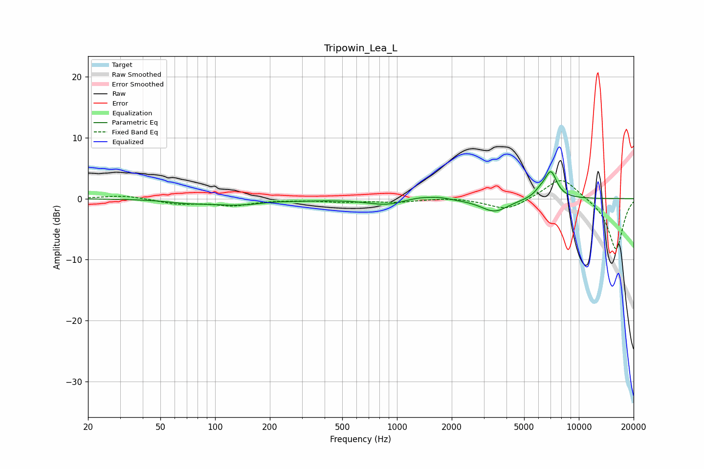

# Tripowin_Lea_L
See [usage instructions](https://github.com/jaakkopasanen/AutoEq#usage) for more options and info.

### Parametric EQs
Apply preamp of -4.5 dB when using parametric equalizer.

|   # | Type    |   Fc (Hz) |    Q |   Gain (dB) |
|-----|---------|-----------|------|-------------|
|   1 | Peaking |        68 | 1.67 |        -0.3 |
|   2 | Peaking |       139 | 0.68 |        -1.1 |
|   3 | Peaking |       202 | 1.59 |         0.3 |
|   4 | Peaking |       866 | 1.42 |        -0.8 |
|   5 | Peaking |       977 | 1.07 |        -0.3 |
|   6 | Peaking |      1322 | 1.7  |         0.6 |
|   7 | Peaking |      1722 | 2.64 |         0.3 |
|   8 | Peaking |      3445 | 1.84 |        -2.1 |
|   9 | Peaking |      6134 | 4.35 |         0.8 |
|  10 | Peaking |      7011 | 3.94 |         4.3 |

### Fixed Band EQs
When using fixed band (also called graphic) equalizer, apply preamp of **-3.0 dB** (if available) and set gains manually with these parameters.

|   # | Type    |   Fc (Hz) |    Q |   Gain (dB) |
|-----|---------|-----------|------|-------------|
|   1 | Peaking |        31 | 1.41 |         0.6 |
|   2 | Peaking |        62 | 1.41 |        -0.8 |
|   3 | Peaking |       125 | 1.41 |        -1   |
|   4 | Peaking |       250 | 1.41 |        -0.1 |
|   5 | Peaking |       500 | 1.41 |        -0.5 |
|   6 | Peaking |      1000 | 1.41 |        -0.5 |
|   7 | Peaking |      2000 | 1.41 |         0.2 |
|   8 | Peaking |      4000 | 1.41 |        -1.9 |
|   9 | Peaking |      8000 | 1.41 |         3.7 |
|  10 | Peaking |     16000 | 1.41 |        -8.4 |

### Graphs

