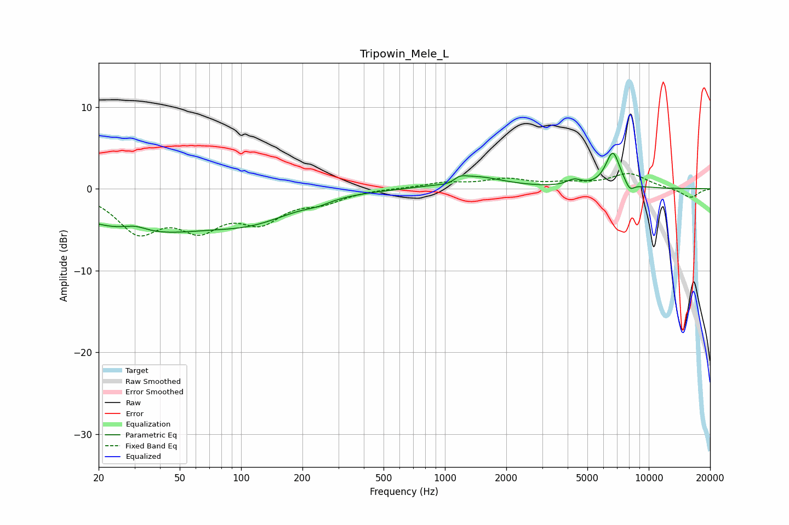

# Tripowin_Mele_L
See [usage instructions](https://github.com/jaakkopasanen/AutoEq#usage) for more options and info.

### Parametric EQs
Apply preamp of -4.4 dB when using parametric equalizer.

|   # | Type    |   Fc (Hz) |    Q |   Gain (dB) |
|-----|---------|-----------|------|-------------|
|   1 | Peaking |        30 | 2.39 |         0.8 |
|   2 | Peaking |        32 | 0.4  |        -5   |
|   3 | Peaking |       117 | 0.68 |        -2.6 |
|   4 | Peaking |       237 | 2.36 |        -0.4 |
|   5 | Peaking |      1065 | 2.87 |        -0.6 |
|   6 | Peaking |      1177 | 4.08 |         0.7 |
|   7 | Peaking |      1409 | 1.05 |         1.5 |
|   8 | Peaking |      4303 | 3.81 |         0.8 |
|   9 | Peaking |      6664 | 3.81 |         4.4 |
|  10 | Peaking |      8075 | 6    |        -1   |

### Fixed Band EQs
When using fixed band (also called graphic) equalizer, apply preamp of **-2.0 dB** (if available) and set gains manually with these parameters.

|   # | Type    |   Fc (Hz) |    Q |   Gain (dB) |
|-----|---------|-----------|------|-------------|
|   1 | Peaking |        31 | 1.41 |        -4.9 |
|   2 | Peaking |        62 | 1.41 |        -4.1 |
|   3 | Peaking |       125 | 1.41 |        -3.5 |
|   4 | Peaking |       250 | 1.41 |        -1.3 |
|   5 | Peaking |       500 | 1.41 |         0.1 |
|   6 | Peaking |      1000 | 1.41 |         0.7 |
|   7 | Peaking |      2000 | 1.41 |         1.1 |
|   8 | Peaking |      4000 | 1.41 |         0.5 |
|   9 | Peaking |      8000 | 1.41 |         1.8 |
|  10 | Peaking |     16000 | 1.41 |        -1.1 |

### Graphs

