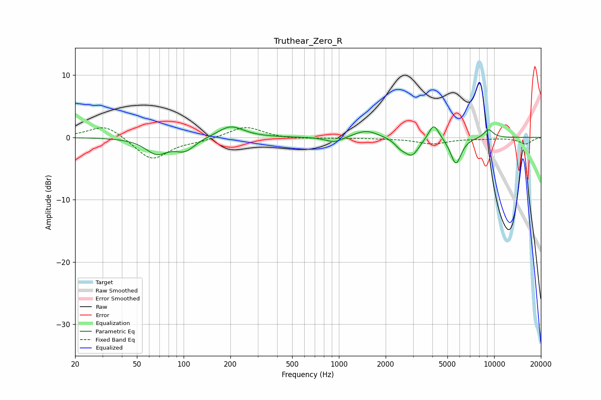

# Truthear_Zero_R
See [usage instructions](https://github.com/jaakkopasanen/AutoEq#usage) for more options and info.

### Parametric EQs
Apply preamp of -1.8 dB when using parametric equalizer.

|   # | Type    |   Fc (Hz) |    Q |   Gain (dB) |
|-----|---------|-----------|------|-------------|
|   1 | Peaking |        67 | 1.98 |        -2.4 |
|   2 | Peaking |       102 | 2.2  |        -1.9 |
|   3 | Peaking |       200 | 1.72 |         1.9 |
|   4 | Peaking |       935 | 2.54 |        -0.9 |
|   5 | Peaking |      1500 | 1.82 |         1.2 |
|   6 | Peaking |      2484 | 4.05 |        -0.9 |
|   7 | Peaking |      2948 | 2.97 |        -2.8 |
|   8 | Peaking |      4085 | 4.14 |         2.7 |
|   9 | Peaking |      5670 | 3.96 |        -4.3 |
|  10 | Peaking |      9206 | 4.09 |         1.4 |

### Fixed Band EQs
When using fixed band (also called graphic) equalizer, apply preamp of **-1.7 dB** (if available) and set gains manually with these parameters.

|   # | Type    |   Fc (Hz) |    Q |   Gain (dB) |
|-----|---------|-----------|------|-------------|
|   1 | Peaking |        31 | 1.41 |         2.2 |
|   2 | Peaking |        62 | 1.41 |        -3.7 |
|   3 | Peaking |       125 | 1.41 |        -0.5 |
|   4 | Peaking |       250 | 1.41 |         1.8 |
|   5 | Peaking |       500 | 1.41 |        -0.3 |
|   6 | Peaking |      1000 | 1.41 |        -0.1 |
|   7 | Peaking |      2000 | 1.41 |        -0.1 |
|   8 | Peaking |      4000 | 1.41 |        -1   |
|   9 | Peaking |      8000 | 1.41 |        -0.2 |
|  10 | Peaking |     16000 | 1.41 |        -1   |

### Graphs

