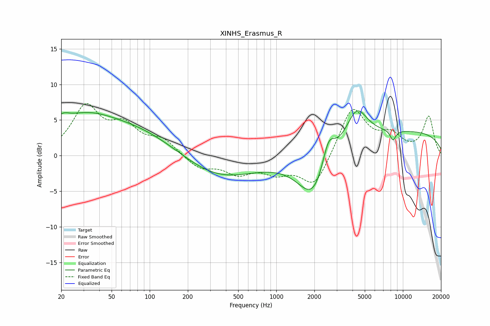

# XINHS_Erasmus_R
See [usage instructions](https://github.com/jaakkopasanen/AutoEq#usage) for more options and info.

### Parametric EQs
Apply preamp of -6.4 dB when using parametric equalizer.

|   # | Type    |   Fc (Hz) |    Q |   Gain (dB) |
|-----|---------|-----------|------|-------------|
|   1 | Peaking |        21 | 5.5  |         3.3 |
|   2 | Peaking |        21 | 5.78 |        -2.8 |
|   3 | Peaking |        34 | 0.89 |         0.9 |
|   4 | Peaking |        35 | 0.18 |         5.3 |
|   5 | Peaking |       322 | 0.46 |        -3.8 |
|   6 | Peaking |      1986 | 1.13 |        -7   |
|   7 | Peaking |      2580 | 2.78 |         4.3 |
|   8 | Peaking |      4308 | 1.68 |         4.7 |
|   9 | Peaking |      8347 | 5.8  |        -1.4 |
|  10 | Peaking |     10000 | 0.21 |         3.4 |

### Fixed Band EQs
When using fixed band (also called graphic) equalizer, apply preamp of **-7.4 dB** (if available) and set gains manually with these parameters.

|   # | Type    |   Fc (Hz) |    Q |   Gain (dB) |
|-----|---------|-----------|------|-------------|
|   1 | Peaking |        31 | 1.41 |         6.6 |
|   2 | Peaking |        62 | 1.41 |         3.6 |
|   3 | Peaking |       125 | 1.41 |         2   |
|   4 | Peaking |       250 | 1.41 |        -1.8 |
|   5 | Peaking |       500 | 1.41 |        -2.2 |
|   6 | Peaking |      1000 | 1.41 |        -2   |
|   7 | Peaking |      2000 | 1.41 |        -4.5 |
|   8 | Peaking |      4000 | 1.41 |         6.9 |
|   9 | Peaking |      8000 | 1.41 |         2.4 |
|  10 | Peaking |     16000 | 1.41 |         5.4 |

### Graphs

