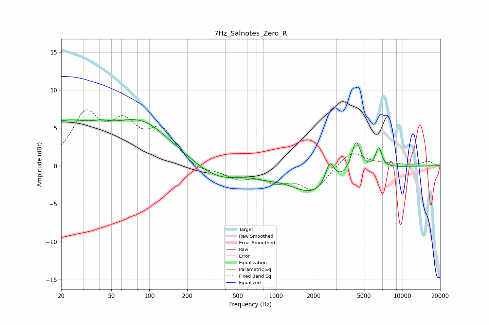

# 7Hz_Salnotes_Zero_R
See [usage instructions](https://github.com/jaakkopasanen/AutoEq#usage) for more options and info.

### Parametric EQs
Apply preamp of -6.2 dB when using parametric equalizer.

|   # | Type    |   Fc (Hz) |    Q |   Gain (dB) |
|-----|---------|-----------|------|-------------|
|   1 | Peaking |        20 | 0.55 |         5.1 |
|   2 | Peaking |        41 | 2.15 |         0.5 |
|   3 | Peaking |        87 | 0.6  |         5.2 |
|   4 | Peaking |       215 | 5.92 |         0   |
|   5 | Peaking |       347 | 0.75 |        -2   |
|   6 | Peaking |       844 | 1.52 |        -0.4 |
|   7 | Peaking |      2014 | 0.73 |        -3.5 |
|   8 | Peaking |      2680 | 4.04 |         3   |
|   9 | Peaking |      4329 | 3.87 |         4.2 |
|  10 | Peaking |      6542 | 5.67 |         2.6 |

### Fixed Band EQs
When using fixed band (also called graphic) equalizer, apply preamp of **-7.5 dB** (if available) and set gains manually with these parameters.

|   # | Type    |   Fc (Hz) |    Q |   Gain (dB) |
|-----|---------|-----------|------|-------------|
|   1 | Peaking |        31 | 1.41 |         6.3 |
|   2 | Peaking |        62 | 1.41 |         4.6 |
|   3 | Peaking |       125 | 1.41 |         4.3 |
|   4 | Peaking |       250 | 1.41 |        -0.9 |
|   5 | Peaking |       500 | 1.41 |        -1.5 |
|   6 | Peaking |      1000 | 1.41 |        -1.7 |
|   7 | Peaking |      2000 | 1.41 |        -3.1 |
|   8 | Peaking |      4000 | 1.41 |         2.1 |
|   9 | Peaking |      8000 | 1.41 |         0.2 |
|  10 | Peaking |     16000 | 1.41 |         0.6 |

### Graphs

