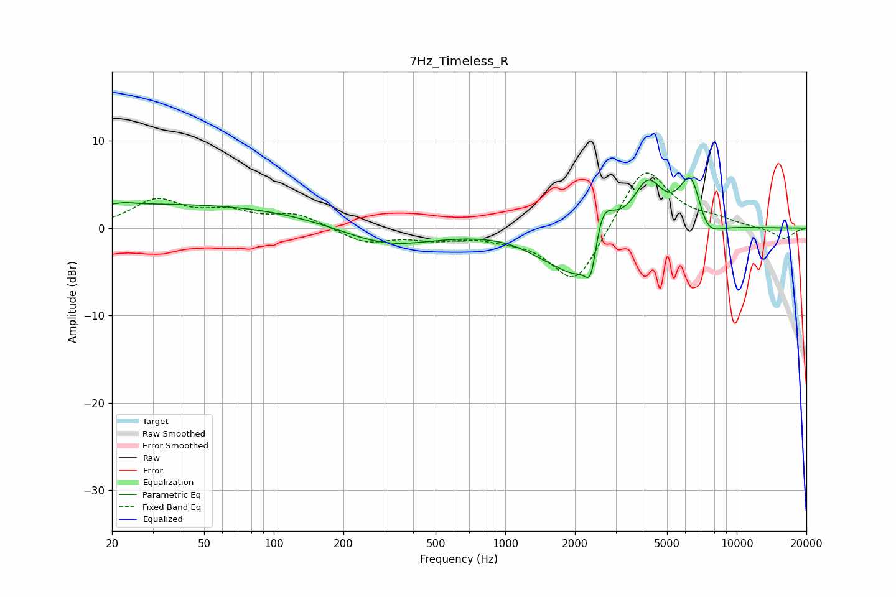

# 7Hz_Timeless_R
See [usage instructions](https://github.com/jaakkopasanen/AutoEq#usage) for more options and info.

### Parametric EQs
Apply preamp of -5.9 dB when using parametric equalizer.

|   # | Type    |   Fc (Hz) |    Q |   Gain (dB) |
|-----|---------|-----------|------|-------------|
|   1 | Peaking |        23 | 3.88 |         0.2 |
|   2 | Peaking |        35 | 0.18 |         2.8 |
|   3 | Peaking |       304 | 0.68 |        -2.4 |
|   4 | Peaking |      1466 | 1.29 |        -1.4 |
|   5 | Peaking |      2117 | 1.42 |        -6.1 |
|   6 | Peaking |      2352 | 5.31 |        -5.2 |
|   7 | Peaking |      2579 | 2.6  |         6.9 |
|   8 | Peaking |      4127 | 2.18 |         5.4 |
|   9 | Peaking |      6372 | 2.68 |         7   |
|  10 | Peaking |      7299 | 2.27 |        -3.3 |

### Fixed Band EQs
When using fixed band (also called graphic) equalizer, apply preamp of **-6.4 dB** (if available) and set gains manually with these parameters.

|   # | Type    |   Fc (Hz) |    Q |   Gain (dB) |
|-----|---------|-----------|------|-------------|
|   1 | Peaking |        31 | 1.41 |         3.1 |
|   2 | Peaking |        62 | 1.41 |         1.6 |
|   3 | Peaking |       125 | 1.41 |         1.5 |
|   4 | Peaking |       250 | 1.41 |        -1.7 |
|   5 | Peaking |       500 | 1.41 |        -1   |
|   6 | Peaking |      1000 | 1.41 |        -0.7 |
|   7 | Peaking |      2000 | 1.41 |        -6.7 |
|   8 | Peaking |      4000 | 1.41 |         7.4 |
|   9 | Peaking |      8000 | 1.41 |         0.7 |
|  10 | Peaking |     16000 | 1.41 |        -1.3 |

### Graphs

