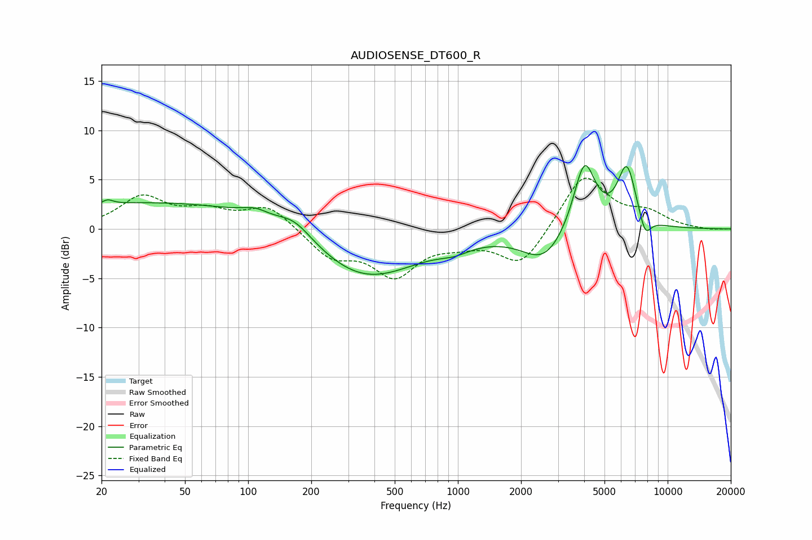

# AUDIOSENSE_DT600_R
See [usage instructions](https://github.com/jaakkopasanen/AutoEq#usage) for more options and info.

### Parametric EQs
Apply preamp of -6.5 dB when using parametric equalizer.

|   # | Type    |   Fc (Hz) |    Q |   Gain (dB) |
|-----|---------|-----------|------|-------------|
|   1 | Peaking |        21 | 5.98 |         0.4 |
|   2 | Peaking |        46 | 0.18 |         2.8 |
|   3 | Peaking |       108 | 2.36 |         0.7 |
|   4 | Peaking |       167 | 1.66 |         1.6 |
|   5 | Peaking |       350 | 0.55 |        -5.6 |
|   6 | Peaking |       966 | 1.89 |        -0.7 |
|   7 | Peaking |      2590 | 1.33 |        -3.3 |
|   8 | Peaking |      4010 | 2.63 |         7.3 |
|   9 | Peaking |      6388 | 3.04 |         6.2 |
|  10 | Peaking |      7804 | 4.67 |        -2.2 |

### Fixed Band EQs
When using fixed band (also called graphic) equalizer, apply preamp of **-5.2 dB** (if available) and set gains manually with these parameters.

|   # | Type    |   Fc (Hz) |    Q |   Gain (dB) |
|-----|---------|-----------|------|-------------|
|   1 | Peaking |        31 | 1.41 |         3.1 |
|   2 | Peaking |        62 | 1.41 |         1.5 |
|   3 | Peaking |       125 | 1.41 |         2.3 |
|   4 | Peaking |       250 | 1.41 |        -2.7 |
|   5 | Peaking |       500 | 1.41 |        -4.4 |
|   6 | Peaking |      1000 | 1.41 |        -1   |
|   7 | Peaking |      2000 | 1.41 |        -3.8 |
|   8 | Peaking |      4000 | 1.41 |         5.7 |
|   9 | Peaking |      8000 | 1.41 |         1.4 |
|  10 | Peaking |     16000 | 1.41 |        -0.1 |

### Graphs

