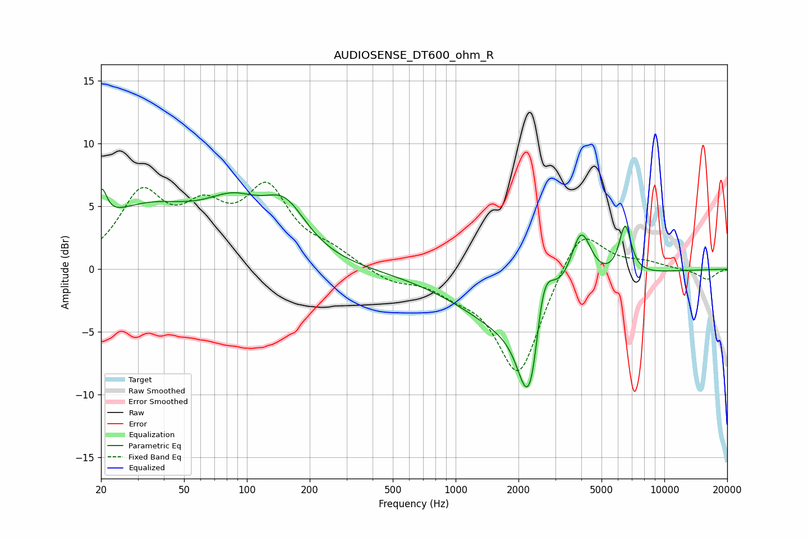

# AUDIOSENSE_DT600_ohm_R
See [usage instructions](https://github.com/jaakkopasanen/AutoEq#usage) for more options and info.

### Parametric EQs
Apply preamp of -6.5 dB when using parametric equalizer.

|   # | Type    |   Fc (Hz) |    Q |   Gain (dB) |
|-----|---------|-----------|------|-------------|
|   1 | Peaking |        20 | 5.84 |         2.6 |
|   2 | Peaking |        33 | 0.53 |         4.6 |
|   3 | Peaking |        87 | 1.01 |         3.1 |
|   4 | Peaking |       152 | 1.33 |         3.7 |
|   5 | Peaking |      1921 | 0.56 |        -4.5 |
|   6 | Peaking |      2117 | 3.68 |        -1.2 |
|   7 | Peaking |      2310 | 2.71 |        -8.6 |
|   8 | Peaking |      2609 | 2.72 |         7   |
|   9 | Peaking |      3988 | 2.78 |         4.8 |
|  10 | Peaking |      6489 | 4.66 |         4   |

### Fixed Band EQs
When using fixed band (also called graphic) equalizer, apply preamp of **-7.0 dB** (if available) and set gains manually with these parameters.

|   # | Type    |   Fc (Hz) |    Q |   Gain (dB) |
|-----|---------|-----------|------|-------------|
|   1 | Peaking |        31 | 1.41 |         5.6 |
|   2 | Peaking |        62 | 1.41 |         3.7 |
|   3 | Peaking |       125 | 1.41 |         5.9 |
|   4 | Peaking |       250 | 1.41 |         1.1 |
|   5 | Peaking |       500 | 1.41 |        -0.9 |
|   6 | Peaking |      1000 | 1.41 |        -1.1 |
|   7 | Peaking |      2000 | 1.41 |        -8.5 |
|   8 | Peaking |      4000 | 1.41 |         3.8 |
|   9 | Peaking |      8000 | 1.41 |         0.5 |
|  10 | Peaking |     16000 | 1.41 |        -0.8 |

### Graphs

