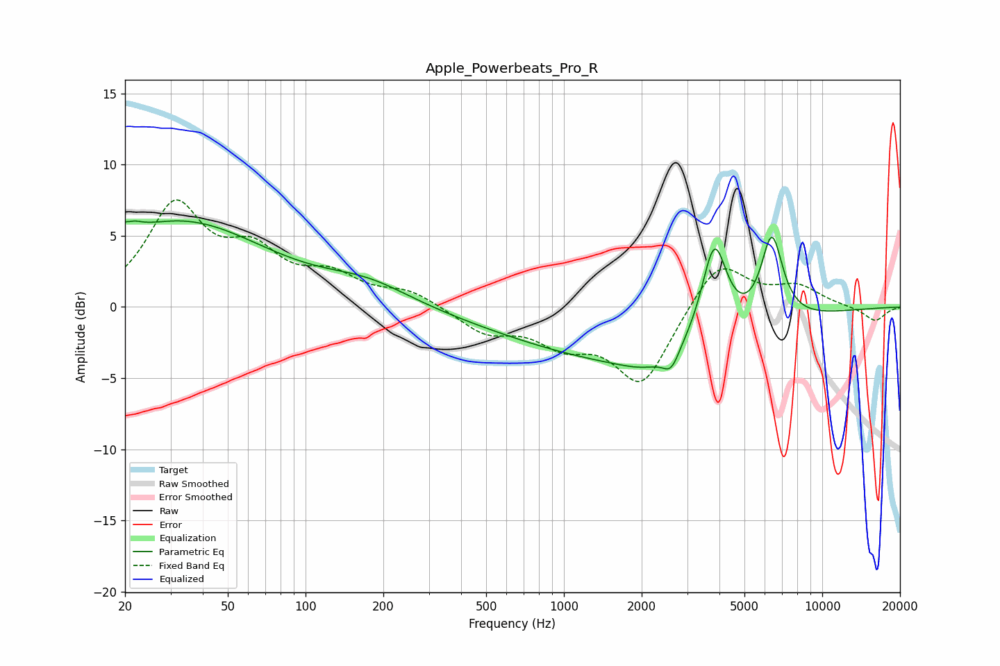

# Apple_Powerbeats_Pro_R
See [usage instructions](https://github.com/jaakkopasanen/AutoEq#usage) for more options and info.

### Parametric EQs
Apply preamp of -6.2 dB when using parametric equalizer.

|   # | Type    |   Fc (Hz) |    Q |   Gain (dB) |
|-----|---------|-----------|------|-------------|
|   1 | Peaking |        21 | 4.86 |         3.9 |
|   2 | Peaking |        21 | 5.69 |        -2.9 |
|   3 | Peaking |        33 | 0.42 |         5.9 |
|   4 | Peaking |       174 | 0.84 |         1.4 |
|   5 | Peaking |       713 | 0.45 |        -1   |
|   6 | Peaking |      2080 | 1.45 |        -0.7 |
|   7 | Peaking |      2280 | 0.37 |        -3.4 |
|   8 | Peaking |      2602 | 4.53 |        -1.3 |
|   9 | Peaking |      3820 | 2.8  |         7   |
|  10 | Peaking |      6381 | 3.17 |         6.1 |

### Fixed Band EQs
When using fixed band (also called graphic) equalizer, apply preamp of **-7.6 dB** (if available) and set gains manually with these parameters.

|   # | Type    |   Fc (Hz) |    Q |   Gain (dB) |
|-----|---------|-----------|------|-------------|
|   1 | Peaking |        31 | 1.41 |         6.9 |
|   2 | Peaking |        62 | 1.41 |         3.2 |
|   3 | Peaking |       125 | 1.41 |         1.9 |
|   4 | Peaking |       250 | 1.41 |         1   |
|   5 | Peaking |       500 | 1.41 |        -1.7 |
|   6 | Peaking |      1000 | 1.41 |        -2.2 |
|   7 | Peaking |      2000 | 1.41 |        -5.4 |
|   8 | Peaking |      4000 | 1.41 |         3.5 |
|   9 | Peaking |      8000 | 1.41 |         1.4 |
|  10 | Peaking |     16000 | 1.41 |        -1   |

### Graphs

