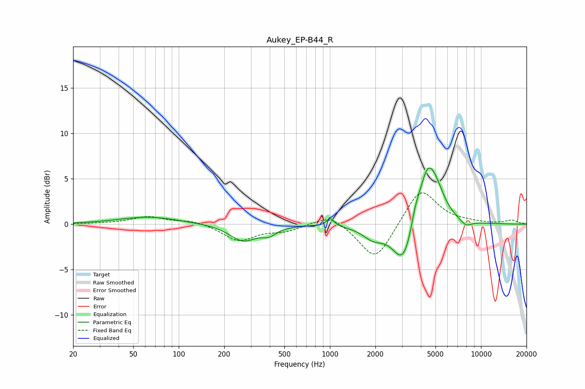

# Aukey_EP-B44_R
See [usage instructions](https://github.com/jaakkopasanen/AutoEq#usage) for more options and info.

### Parametric EQs
Apply preamp of -6.3 dB when using parametric equalizer.

|   # | Type    |   Fc (Hz) |    Q |   Gain (dB) |
|-----|---------|-----------|------|-------------|
|   1 | Peaking |        63 | 0.72 |         0.8 |
|   2 | Peaking |       266 | 1.6  |        -1.8 |
|   3 | Peaking |       396 | 2.84 |        -0.8 |
|   4 | Peaking |      1007 | 6    |         0.9 |
|   5 | Peaking |      1938 | 2    |        -1.3 |
|   6 | Peaking |      3078 | 1.99 |        -5   |
|   7 | Peaking |      3672 | 4.95 |         1.4 |
|   8 | Peaking |      4409 | 2.24 |         5.9 |
|   9 | Peaking |      5060 | 2.25 |         2   |
|  10 | Peaking |      7952 | 3.42 |        -0.7 |

### Fixed Band EQs
When using fixed band (also called graphic) equalizer, apply preamp of **-3.5 dB** (if available) and set gains manually with these parameters.

|   # | Type    |   Fc (Hz) |    Q |   Gain (dB) |
|-----|---------|-----------|------|-------------|
|   1 | Peaking |        31 | 1.41 |         0   |
|   2 | Peaking |        62 | 1.41 |         0.8 |
|   3 | Peaking |       125 | 1.41 |         0.4 |
|   4 | Peaking |       250 | 1.41 |        -1.8 |
|   5 | Peaking |       500 | 1.41 |        -0.7 |
|   6 | Peaking |      1000 | 1.41 |         1.2 |
|   7 | Peaking |      2000 | 1.41 |        -4.2 |
|   8 | Peaking |      4000 | 1.41 |         4.1 |
|   9 | Peaking |      8000 | 1.41 |         0.2 |
|  10 | Peaking |     16000 | 1.41 |         0.4 |

### Graphs

