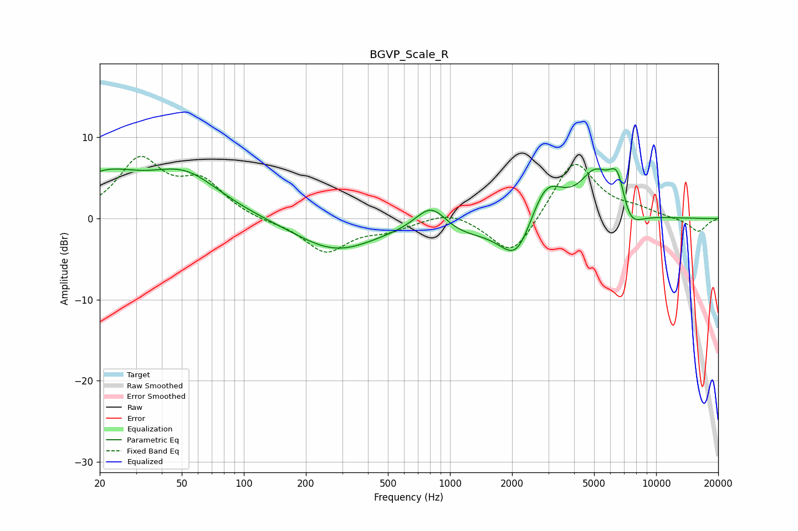

# BGVP_Scale_R
See [usage instructions](https://github.com/jaakkopasanen/AutoEq#usage) for more options and info.

### Parametric EQs
Apply preamp of -6.2 dB when using parametric equalizer.

|   # | Type    |   Fc (Hz) |    Q |   Gain (dB) |
|-----|---------|-----------|------|-------------|
|   1 | Peaking |        21 | 0.81 |         4.7 |
|   2 | Peaking |        52 | 0.81 |         4.9 |
|   3 | Peaking |       278 | 0.72 |        -3.9 |
|   4 | Peaking |       812 | 1.8  |         3.7 |
|   5 | Peaking |      1059 | 0.83 |        -2   |
|   6 | Peaking |      2118 | 1.68 |        -5.9 |
|   7 | Peaking |      2900 | 1.64 |         5.7 |
|   8 | Peaking |      5024 | 1.94 |         4.6 |
|   9 | Peaking |      6536 | 2.83 |         6.8 |
|  10 | Peaking |      7236 | 2.31 |        -4.5 |

### Fixed Band EQs
When using fixed band (also called graphic) equalizer, apply preamp of **-7.8 dB** (if available) and set gains manually with these parameters.

|   # | Type    |   Fc (Hz) |    Q |   Gain (dB) |
|-----|---------|-----------|------|-------------|
|   1 | Peaking |        31 | 1.41 |         6.9 |
|   2 | Peaking |        62 | 1.41 |         4.1 |
|   3 | Peaking |       125 | 1.41 |        -0.4 |
|   4 | Peaking |       250 | 1.41 |        -4.1 |
|   5 | Peaking |       500 | 1.41 |        -1.2 |
|   6 | Peaking |      1000 | 1.41 |         1.1 |
|   7 | Peaking |      2000 | 1.41 |        -5.1 |
|   8 | Peaking |      4000 | 1.41 |         7.4 |
|   9 | Peaking |      8000 | 1.41 |         0.9 |
|  10 | Peaking |     16000 | 1.41 |        -1.7 |

### Graphs

