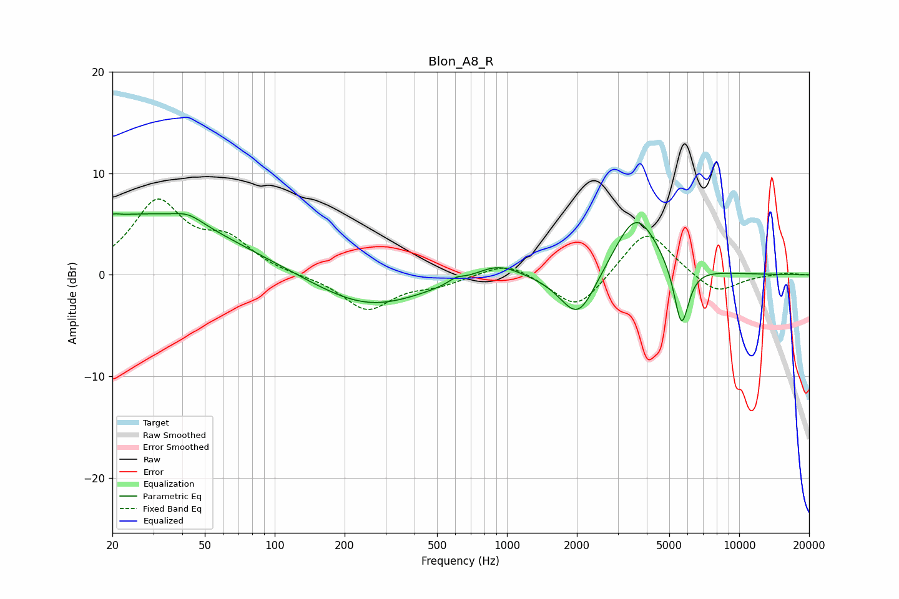

# Blon_A8_R
See [usage instructions](https://github.com/jaakkopasanen/AutoEq#usage) for more options and info.

### Parametric EQs
Apply preamp of -6.1 dB when using parametric equalizer.

|   # | Type    |   Fc (Hz) |    Q |   Gain (dB) |
|-----|---------|-----------|------|-------------|
|   1 | Peaking |        20 | 6    |        -2.8 |
|   2 | Peaking |        20 | 5.99 |         3   |
|   3 | Peaking |        26 | 0.35 |         5.9 |
|   4 | Peaking |        42 | 2.21 |         0.9 |
|   5 | Peaking |       253 | 0.61 |        -3.3 |
|   6 | Peaking |       604 | 4.45 |         0.5 |
|   7 | Peaking |       912 | 1.43 |         1.5 |
|   8 | Peaking |      2027 | 1.8  |        -4.9 |
|   9 | Peaking |      3599 | 1.47 |         6.3 |
|  10 | Peaking |      5640 | 4.32 |        -6.3 |

### Fixed Band EQs
When using fixed band (also called graphic) equalizer, apply preamp of **-7.6 dB** (if available) and set gains manually with these parameters.

|   # | Type    |   Fc (Hz) |    Q |   Gain (dB) |
|-----|---------|-----------|------|-------------|
|   1 | Peaking |        31 | 1.41 |         7   |
|   2 | Peaking |        62 | 1.41 |         3   |
|   3 | Peaking |       125 | 1.41 |        -0.1 |
|   4 | Peaking |       250 | 1.41 |        -3.4 |
|   5 | Peaking |       500 | 1.41 |        -0.8 |
|   6 | Peaking |      1000 | 1.41 |         1.4 |
|   7 | Peaking |      2000 | 1.41 |        -3.6 |
|   8 | Peaking |      4000 | 1.41 |         4.7 |
|   9 | Peaking |      8000 | 1.41 |        -2   |
|  10 | Peaking |     16000 | 1.41 |         0.2 |

### Graphs

