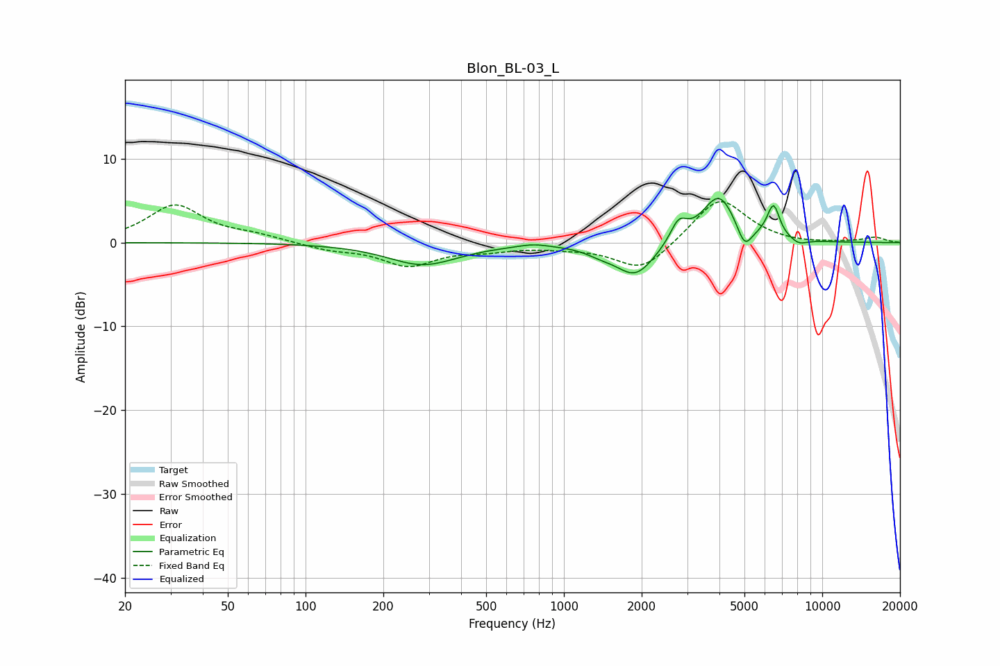

# Blon_BL-03_L
See [usage instructions](https://github.com/jaakkopasanen/AutoEq#usage) for more options and info.

### Parametric EQs
Apply preamp of -5.4 dB when using parametric equalizer.

|   # | Type    |   Fc (Hz) |    Q |   Gain (dB) |
|-----|---------|-----------|------|-------------|
|   1 | Peaking |       284 | 1.04 |        -2.6 |
|   2 | Peaking |       761 | 2.48 |         0.4 |
|   3 | Peaking |      1378 | 2.62 |        -0.6 |
|   4 | Peaking |      1891 | 1.82 |        -4   |
|   5 | Peaking |      2780 | 4.31 |         2.5 |
|   6 | Peaking |      3984 | 2.12 |         5.8 |
|   7 | Peaking |      5003 | 4.79 |        -2.8 |
|   8 | Peaking |      6346 | 4.44 |         0.8 |
|   9 | Peaking |      6493 | 5.97 |         3.2 |
|  10 | Peaking |      8124 | 4.12 |        -0.6 |

### Fixed Band EQs
When using fixed band (also called graphic) equalizer, apply preamp of **-5.0 dB** (if available) and set gains manually with these parameters.

|   # | Type    |   Fc (Hz) |    Q |   Gain (dB) |
|-----|---------|-----------|------|-------------|
|   1 | Peaking |        31 | 1.41 |         4.4 |
|   2 | Peaking |        62 | 1.41 |         0.7 |
|   3 | Peaking |       125 | 1.41 |        -0.8 |
|   4 | Peaking |       250 | 1.41 |        -2.6 |
|   5 | Peaking |       500 | 1.41 |        -0.7 |
|   6 | Peaking |      1000 | 1.41 |        -0.4 |
|   7 | Peaking |      2000 | 1.41 |        -3.5 |
|   8 | Peaking |      4000 | 1.41 |         5.5 |
|   9 | Peaking |      8000 | 1.41 |        -0.2 |
|  10 | Peaking |     16000 | 1.41 |         0.6 |

### Graphs

