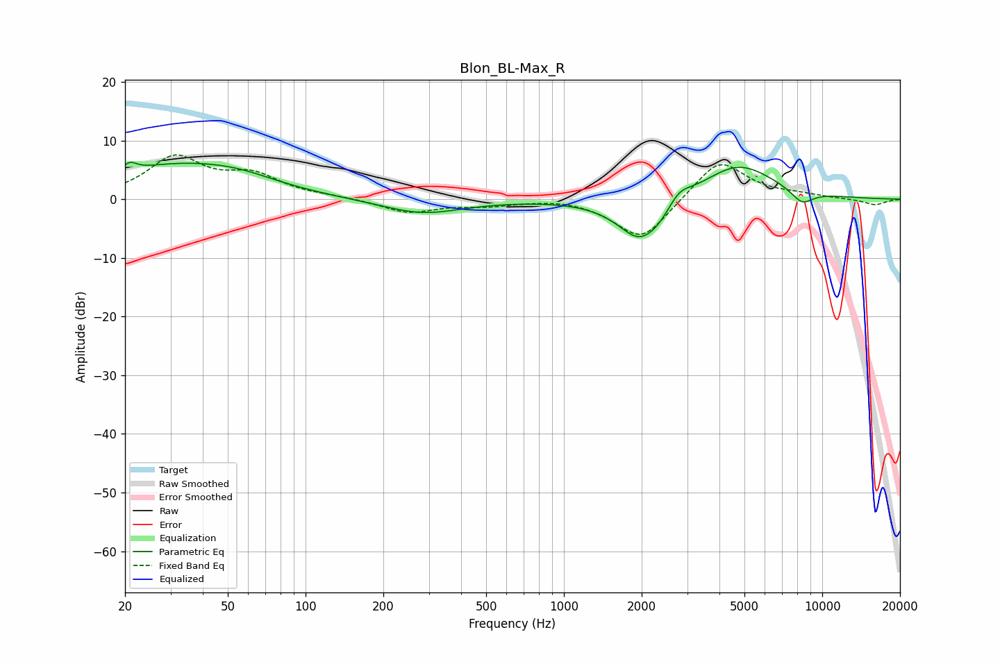

# Blon_BL-Max_R
See [usage instructions](https://github.com/jaakkopasanen/AutoEq#usage) for more options and info.

### Parametric EQs
Apply preamp of -6.4 dB when using parametric equalizer.

|   # | Type    |   Fc (Hz) |    Q |   Gain (dB) |
|-----|---------|-----------|------|-------------|
|   1 | Peaking |        21 | 5.25 |         1.5 |
|   2 | Peaking |        31 | 0.53 |         5.3 |
|   3 | Peaking |        55 | 0.92 |         1.6 |
|   4 | Peaking |       207 | 5.92 |         0   |
|   5 | Peaking |       282 | 0.9  |        -2.5 |
|   6 | Peaking |      1968 | 1.6  |        -7.3 |
|   7 | Peaking |      2349 | 2.84 |        -1.2 |
|   8 | Peaking |      2791 | 3.28 |         2   |
|   9 | Peaking |      4717 | 0.96 |         6.2 |
|  10 | Peaking |      8348 | 2.96 |        -2.4 |

### Fixed Band EQs
When using fixed band (also called graphic) equalizer, apply preamp of **-7.7 dB** (if available) and set gains manually with these parameters.

|   # | Type    |   Fc (Hz) |    Q |   Gain (dB) |
|-----|---------|-----------|------|-------------|
|   1 | Peaking |        31 | 1.41 |         6.9 |
|   2 | Peaking |        62 | 1.41 |         3.6 |
|   3 | Peaking |       125 | 1.41 |         0.3 |
|   4 | Peaking |       250 | 1.41 |        -2.3 |
|   5 | Peaking |       500 | 1.41 |        -0.9 |
|   6 | Peaking |      1000 | 1.41 |         0.4 |
|   7 | Peaking |      2000 | 1.41 |        -7.3 |
|   8 | Peaking |      4000 | 1.41 |         7.1 |
|   9 | Peaking |      8000 | 1.41 |         0.6 |
|  10 | Peaking |     16000 | 1.41 |        -1   |

### Graphs

