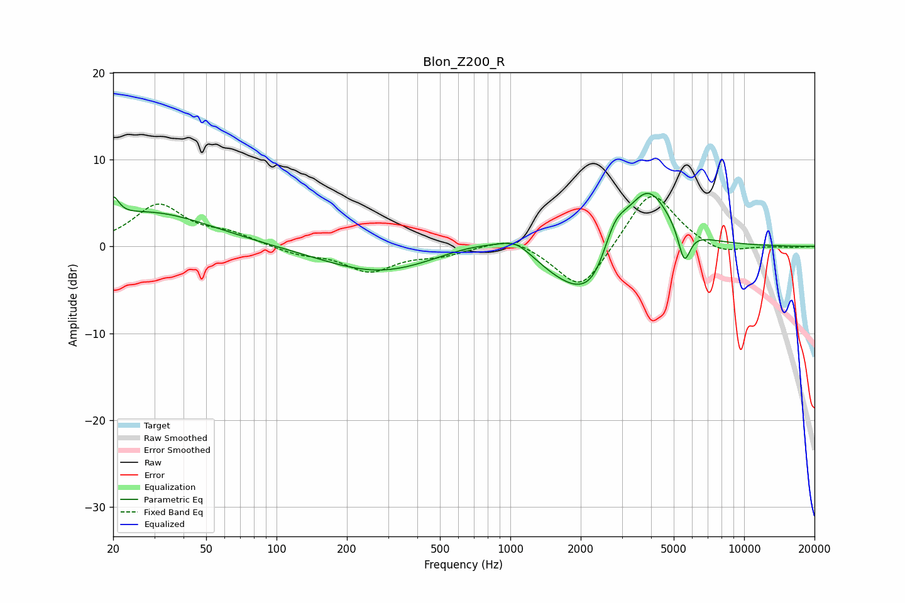

# Blon_Z200_R
See [usage instructions](https://github.com/jaakkopasanen/AutoEq#usage) for more options and info.

### Parametric EQs
Apply preamp of -6.2 dB when using parametric equalizer.

|   # | Type    |   Fc (Hz) |    Q |   Gain (dB) |
|-----|---------|-----------|------|-------------|
|   1 | Peaking |        20 | 5.96 |         2.3 |
|   2 | Peaking |        29 | 0.54 |         3.9 |
|   3 | Peaking |       275 | 0.59 |        -3.1 |
|   4 | Peaking |       729 | 0.88 |         1.4 |
|   5 | Peaking |      1060 | 2.01 |         1.6 |
|   6 | Peaking |      1951 | 0.94 |        -5.3 |
|   7 | Peaking |      2304 | 2.04 |        -2.2 |
|   8 | Peaking |      2791 | 2.64 |         3.7 |
|   9 | Peaking |      3866 | 1.41 |         7.5 |
|  10 | Peaking |      5546 | 5.41 |        -4   |

### Fixed Band EQs
When using fixed band (also called graphic) equalizer, apply preamp of **-5.8 dB** (if available) and set gains manually with these parameters.

|   # | Type    |   Fc (Hz) |    Q |   Gain (dB) |
|-----|---------|-----------|------|-------------|
|   1 | Peaking |        31 | 1.41 |         4.7 |
|   2 | Peaking |        62 | 1.41 |         1.3 |
|   3 | Peaking |       125 | 1.41 |        -0.8 |
|   4 | Peaking |       250 | 1.41 |        -2.7 |
|   5 | Peaking |       500 | 1.41 |        -0.9 |
|   6 | Peaking |      1000 | 1.41 |         1.4 |
|   7 | Peaking |      2000 | 1.41 |        -5.5 |
|   8 | Peaking |      4000 | 1.41 |         6.8 |
|   9 | Peaking |      8000 | 1.41 |        -1.1 |
|  10 | Peaking |     16000 | 1.41 |        -0.1 |

### Graphs

