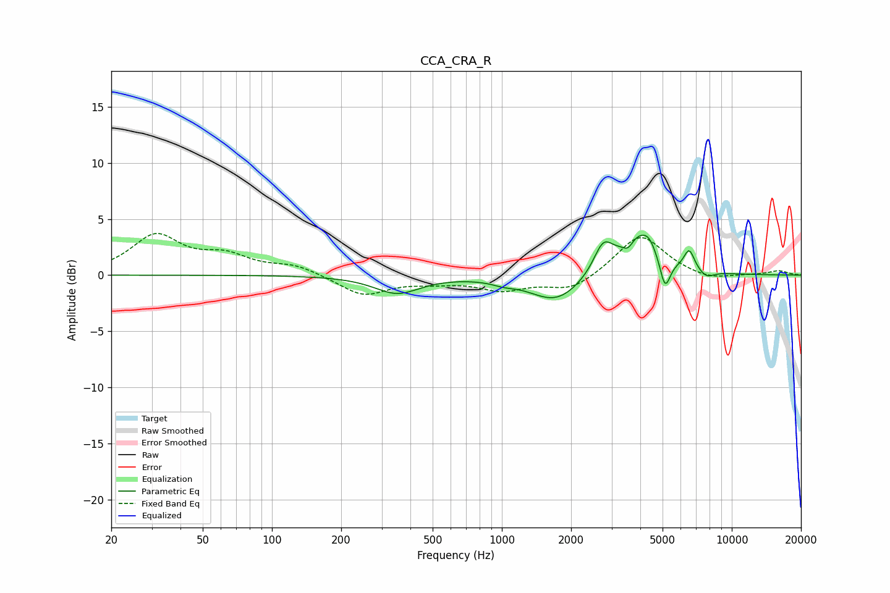

# CCA_CRA_R
See [usage instructions](https://github.com/jaakkopasanen/AutoEq#usage) for more options and info.

### Parametric EQs
Apply preamp of -3.7 dB when using parametric equalizer.

|   # | Type    |   Fc (Hz) |    Q |   Gain (dB) |
|-----|---------|-----------|------|-------------|
|   1 | Peaking |       350 | 1.44 |        -1.6 |
|   2 | Peaking |      1019 | 2.81 |        -0.3 |
|   3 | Peaking |      1722 | 1.25 |        -2.4 |
|   4 | Peaking |      2757 | 3.4  |         2.5 |
|   5 | Peaking |      3539 | 6    |        -0.9 |
|   6 | Peaking |      3973 | 1.64 |         3.8 |
|   7 | Peaking |      4361 | 5.18 |         0.6 |
|   8 | Peaking |      5124 | 6    |        -2.9 |
|   9 | Peaking |      6529 | 6    |         1.8 |
|  10 | Peaking |      7746 | 4.22 |        -0.6 |

### Fixed Band EQs
When using fixed band (also called graphic) equalizer, apply preamp of **-3.8 dB** (if available) and set gains manually with these parameters.

|   # | Type    |   Fc (Hz) |    Q |   Gain (dB) |
|-----|---------|-----------|------|-------------|
|   1 | Peaking |        31 | 1.41 |         3.4 |
|   2 | Peaking |        62 | 1.41 |         1.5 |
|   3 | Peaking |       125 | 1.41 |         0.8 |
|   4 | Peaking |       250 | 1.41 |        -1.8 |
|   5 | Peaking |       500 | 1.41 |        -0.5 |
|   6 | Peaking |      1000 | 1.41 |        -1.2 |
|   7 | Peaking |      2000 | 1.41 |        -1.4 |
|   8 | Peaking |      4000 | 1.41 |         3.7 |
|   9 | Peaking |      8000 | 1.41 |        -0.5 |
|  10 | Peaking |     16000 | 1.41 |         0.4 |

### Graphs

