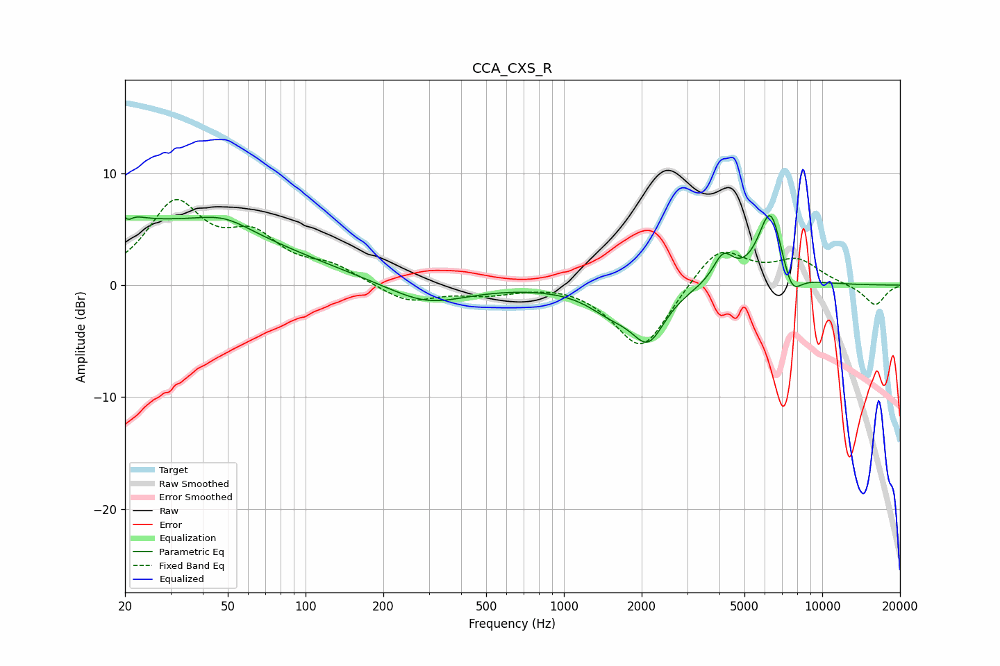

# CCA_CXS_R
See [usage instructions](https://github.com/jaakkopasanen/AutoEq#usage) for more options and info.

### Parametric EQs
Apply preamp of -6.3 dB when using parametric equalizer.

|   # | Type    |   Fc (Hz) |    Q |   Gain (dB) |
|-----|---------|-----------|------|-------------|
|   1 | Peaking |        20 | 4.39 |         4.1 |
|   2 | Peaking |        20 | 5.74 |        -3.6 |
|   3 | Peaking |        27 | 0.28 |         5.5 |
|   4 | Peaking |        48 | 1.39 |         1.1 |
|   5 | Peaking |       295 | 0.95 |        -1.9 |
|   6 | Peaking |      1526 | 1.54 |        -1.8 |
|   7 | Peaking |      2121 | 2.17 |        -4.4 |
|   8 | Peaking |      4138 | 3.52 |         2.5 |
|   9 | Peaking |      6303 | 2.81 |         6.9 |
|  10 | Peaking |      7601 | 3.53 |        -2.5 |

### Fixed Band EQs
When using fixed band (also called graphic) equalizer, apply preamp of **-7.7 dB** (if available) and set gains manually with these parameters.

|   # | Type    |   Fc (Hz) |    Q |   Gain (dB) |
|-----|---------|-----------|------|-------------|
|   1 | Peaking |        31 | 1.41 |         6.9 |
|   2 | Peaking |        62 | 1.41 |         3.7 |
|   3 | Peaking |       125 | 1.41 |         1.4 |
|   4 | Peaking |       250 | 1.41 |        -1.6 |
|   5 | Peaking |       500 | 1.41 |        -0.7 |
|   6 | Peaking |      1000 | 1.41 |         0.3 |
|   7 | Peaking |      2000 | 1.41 |        -5.9 |
|   8 | Peaking |      4000 | 1.41 |         3.6 |
|   9 | Peaking |      8000 | 1.41 |         2.1 |
|  10 | Peaking |     16000 | 1.41 |        -1.9 |

### Graphs

