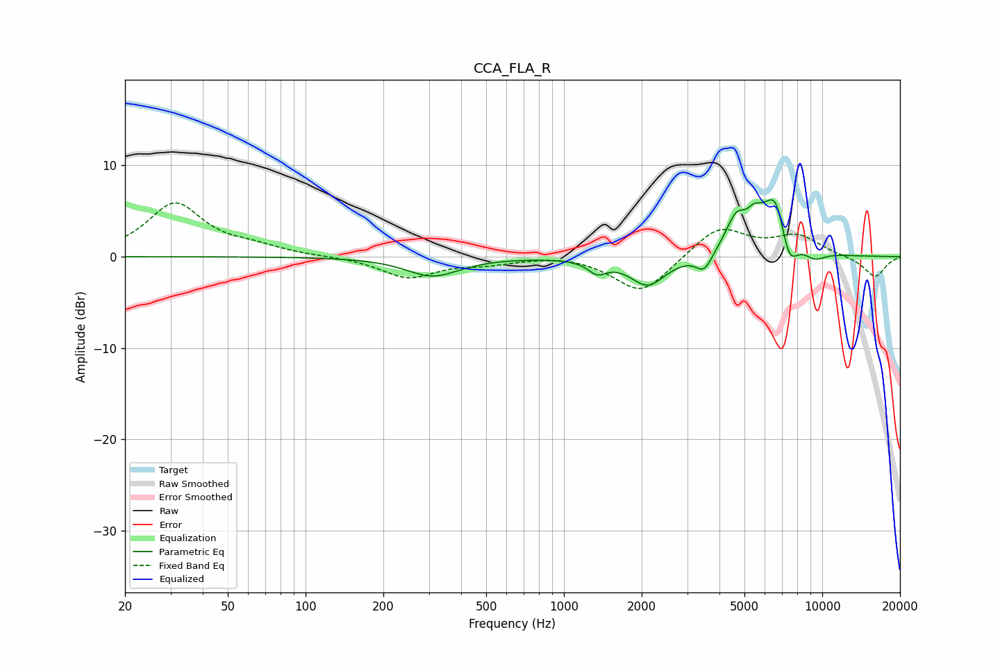

# CCA_FLA_R
See [usage instructions](https://github.com/jaakkopasanen/AutoEq#usage) for more options and info.

### Parametric EQs
Apply preamp of -6.3 dB when using parametric equalizer.

|   # | Type    |   Fc (Hz) |    Q |   Gain (dB) |
|-----|---------|-----------|------|-------------|
|   1 | Peaking |       310 | 1.38 |        -2.1 |
|   2 | Peaking |      1345 | 4.02 |        -1.3 |
|   3 | Peaking |      2115 | 2.04 |        -3.1 |
|   4 | Peaking |      3490 | 4.49 |        -1.9 |
|   5 | Peaking |      4641 | 3.43 |         3.4 |
|   6 | Peaking |      5458 | 5.12 |         1.5 |
|   7 | Peaking |      6482 | 2.18 |         6   |
|   8 | Peaking |      6643 | 6    |         1.1 |
|   9 | Peaking |      7444 | 4.01 |        -3.7 |
|  10 | Peaking |      9347 | 3.08 |        -1   |

### Fixed Band EQs
When using fixed band (also called graphic) equalizer, apply preamp of **-6.0 dB** (if available) and set gains manually with these parameters.

|   # | Type    |   Fc (Hz) |    Q |   Gain (dB) |
|-----|---------|-----------|------|-------------|
|   1 | Peaking |        31 | 1.41 |         5.8 |
|   2 | Peaking |        62 | 1.41 |         0.8 |
|   3 | Peaking |       125 | 1.41 |         0   |
|   4 | Peaking |       250 | 1.41 |        -2.3 |
|   5 | Peaking |       500 | 1.41 |        -0.6 |
|   6 | Peaking |      1000 | 1.41 |         0.3 |
|   7 | Peaking |      2000 | 1.41 |        -4.1 |
|   8 | Peaking |      4000 | 1.41 |         3.4 |
|   9 | Peaking |      8000 | 1.41 |         2.2 |
|  10 | Peaking |     16000 | 1.41 |        -2.3 |

### Graphs

