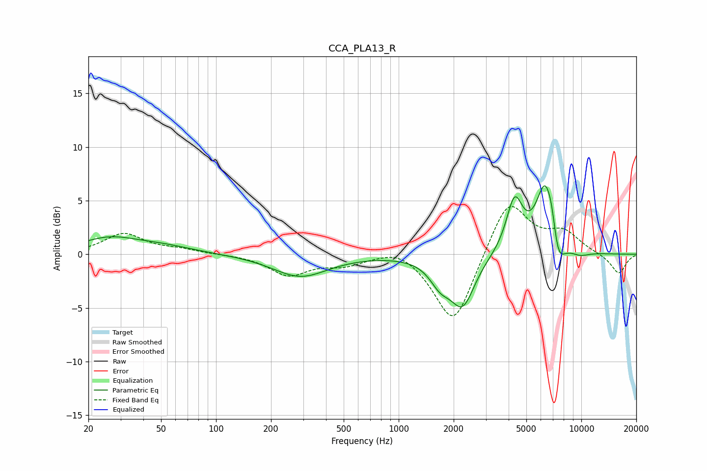

# CCA_PLA13_R
See [usage instructions](https://github.com/jaakkopasanen/AutoEq#usage) for more options and info.

### Parametric EQs
Apply preamp of -6.5 dB when using parametric equalizer.

|   # | Type    |   Fc (Hz) |    Q |   Gain (dB) |
|-----|---------|-----------|------|-------------|
|   1 | Peaking |        26 | 0.92 |         1.4 |
|   2 | Peaking |        51 | 0.8  |         0.6 |
|   3 | Peaking |       289 | 0.94 |        -2.1 |
|   4 | Peaking |      1692 | 2.38 |        -2   |
|   5 | Peaking |      2243 | 2.14 |        -4.5 |
|   6 | Peaking |      4310 | 3.09 |         4.9 |
|   7 | Peaking |      6341 | 2.65 |         6.6 |
|   8 | Peaking |      6925 | 5.15 |         2   |
|   9 | Peaking |      7365 | 3.42 |        -3.7 |
|  10 | Peaking |      9826 | 2.47 |        -0.4 |

### Fixed Band EQs
When using fixed band (also called graphic) equalizer, apply preamp of **-4.6 dB** (if available) and set gains manually with these parameters.

|   # | Type    |   Fc (Hz) |    Q |   Gain (dB) |
|-----|---------|-----------|------|-------------|
|   1 | Peaking |        31 | 1.41 |         1.9 |
|   2 | Peaking |        62 | 1.41 |         0.4 |
|   3 | Peaking |       125 | 1.41 |        -0   |
|   4 | Peaking |       250 | 1.41 |        -1.9 |
|   5 | Peaking |       500 | 1.41 |        -0.8 |
|   6 | Peaking |      1000 | 1.41 |         0.9 |
|   7 | Peaking |      2000 | 1.41 |        -6.8 |
|   8 | Peaking |      4000 | 1.41 |         5.3 |
|   9 | Peaking |      8000 | 1.41 |         1.9 |
|  10 | Peaking |     16000 | 1.41 |        -1.9 |

### Graphs

