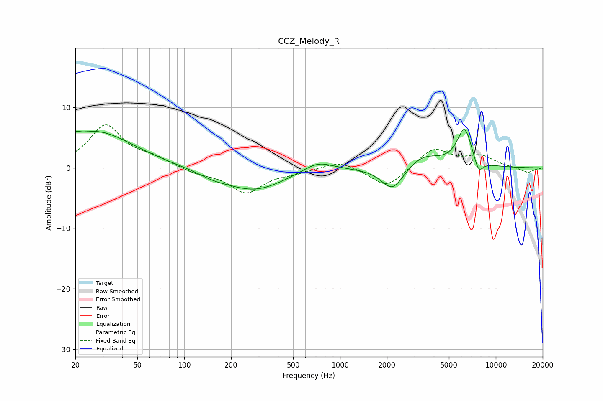

# CCZ_Melody_R
See [usage instructions](https://github.com/jaakkopasanen/AutoEq#usage) for more options and info.

### Parametric EQs
Apply preamp of -6.4 dB when using parametric equalizer.

|   # | Type    |   Fc (Hz) |    Q |   Gain (dB) |
|-----|---------|-----------|------|-------------|
|   1 | Peaking |        20 | 5.49 |         0.9 |
|   2 | Peaking |        26 | 0.67 |         5.2 |
|   3 | Peaking |        41 | 0.64 |         1.1 |
|   4 | Peaking |       153 | 1.55 |        -0.7 |
|   5 | Peaking |       281 | 0.72 |        -3.7 |
|   6 | Peaking |       719 | 1.47 |         1.7 |
|   7 | Peaking |      2170 | 2    |        -4   |
|   8 | Peaking |      3436 | 1.38 |         2.1 |
|   9 | Peaking |      6307 | 2.76 |         6.4 |
|  10 | Peaking |      7742 | 4.34 |        -2.5 |

### Fixed Band EQs
When using fixed band (also called graphic) equalizer, apply preamp of **-7.2 dB** (if available) and set gains manually with these parameters.

|   # | Type    |   Fc (Hz) |    Q |   Gain (dB) |
|-----|---------|-----------|------|-------------|
|   1 | Peaking |        31 | 1.41 |         6.9 |
|   2 | Peaking |        62 | 1.41 |         1.3 |
|   3 | Peaking |       125 | 1.41 |        -0.9 |
|   4 | Peaking |       250 | 1.41 |        -4   |
|   5 | Peaking |       500 | 1.41 |        -0.6 |
|   6 | Peaking |      1000 | 1.41 |         1.3 |
|   7 | Peaking |      2000 | 1.41 |        -3.4 |
|   8 | Peaking |      4000 | 1.41 |         3.3 |
|   9 | Peaking |      8000 | 1.41 |         1.8 |
|  10 | Peaking |     16000 | 1.41 |        -0.8 |

### Graphs

