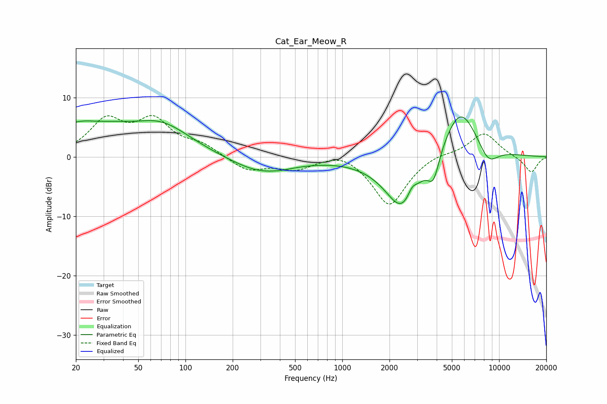

# Cat_Ear_Meow_R
See [usage instructions](https://github.com/jaakkopasanen/AutoEq#usage) for more options and info.

### Parametric EQs
Apply preamp of -6.8 dB when using parametric equalizer.

|   # | Type    |   Fc (Hz) |    Q |   Gain (dB) |
|-----|---------|-----------|------|-------------|
|   1 | Peaking |        20 | 0.81 |         4.6 |
|   2 | Peaking |        36 | 1.19 |         1.1 |
|   3 | Peaking |        69 | 0.72 |         5.3 |
|   4 | Peaking |       307 | 0.73 |        -2.8 |
|   5 | Peaking |       404 | 5.97 |        -0.1 |
|   6 | Peaking |      2411 | 1.24 |        -9.3 |
|   7 | Peaking |      2788 | 5.12 |         1.5 |
|   8 | Peaking |      3820 | 3.77 |        -4.4 |
|   9 | Peaking |      5652 | 1.15 |         9.2 |
|  10 | Peaking |      8491 | 1.93 |        -3.5 |

### Fixed Band EQs
When using fixed band (also called graphic) equalizer, apply preamp of **-7.1 dB** (if available) and set gains manually with these parameters.

|   # | Type    |   Fc (Hz) |    Q |   Gain (dB) |
|-----|---------|-----------|------|-------------|
|   1 | Peaking |        31 | 1.41 |         5.8 |
|   2 | Peaking |        62 | 1.41 |         5.6 |
|   3 | Peaking |       125 | 1.41 |         1.8 |
|   4 | Peaking |       250 | 1.41 |        -2.3 |
|   5 | Peaking |       500 | 1.41 |        -1.9 |
|   6 | Peaking |      1000 | 1.41 |         1.3 |
|   7 | Peaking |      2000 | 1.41 |        -8.3 |
|   8 | Peaking |      4000 | 1.41 |         0.8 |
|   9 | Peaking |      8000 | 1.41 |         4.1 |
|  10 | Peaking |     16000 | 1.41 |        -2.7 |

### Graphs

