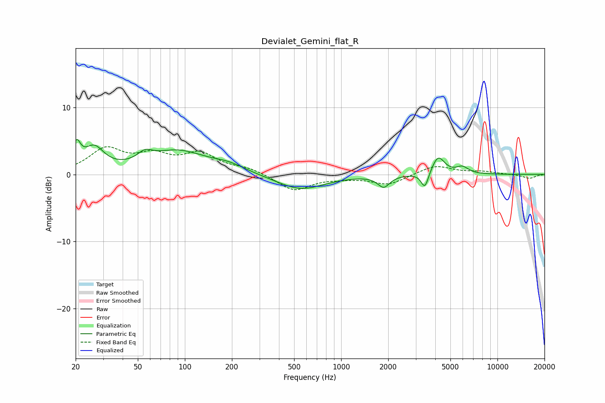

# Devialet_Gemini_flat_R
See [usage instructions](https://github.com/jaakkopasanen/AutoEq#usage) for more options and info.

### Parametric EQs
Apply preamp of -5.3 dB when using parametric equalizer.

|   # | Type    |   Fc (Hz) |    Q |   Gain (dB) |
|-----|---------|-----------|------|-------------|
|   1 | Peaking |        20 | 5.58 |         3.4 |
|   2 | Peaking |        26 | 2.23 |         3.4 |
|   3 | Peaking |        56 | 3.09 |         1.3 |
|   4 | Peaking |        89 | 0.76 |         3.4 |
|   5 | Peaking |       192 | 1.34 |         0.9 |
|   6 | Peaking |       549 | 0.92 |        -2.3 |
|   7 | Peaking |      1871 | 3.76 |        -1.7 |
|   8 | Peaking |      3433 | 6    |        -2.5 |
|   9 | Peaking |      4176 | 3.44 |         2.7 |
|  10 | Peaking |      5958 | 3.56 |         1   |

### Fixed Band EQs
When using fixed band (also called graphic) equalizer, apply preamp of **-4.2 dB** (if available) and set gains manually with these parameters.

|   # | Type    |   Fc (Hz) |    Q |   Gain (dB) |
|-----|---------|-----------|------|-------------|
|   1 | Peaking |        31 | 1.41 |         3.6 |
|   2 | Peaking |        62 | 1.41 |         2.4 |
|   3 | Peaking |       125 | 1.41 |         2.8 |
|   4 | Peaking |       250 | 1.41 |         0.8 |
|   5 | Peaking |       500 | 1.41 |        -2.4 |
|   6 | Peaking |      1000 | 1.41 |        -0.4 |
|   7 | Peaking |      2000 | 1.41 |        -1.5 |
|   8 | Peaking |      4000 | 1.41 |         1.4 |
|   9 | Peaking |      8000 | 1.41 |         0.4 |
|  10 | Peaking |     16000 | 1.41 |        -0.6 |

### Graphs

