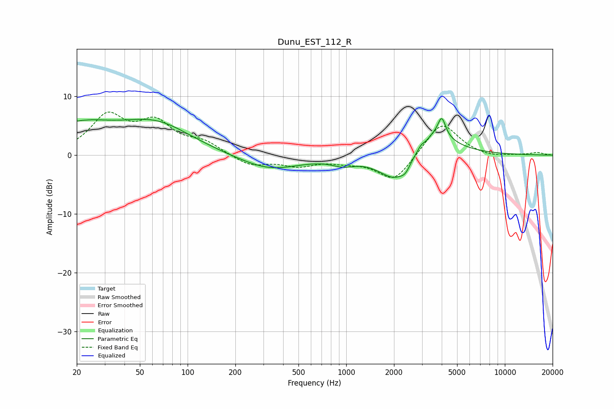

# Dunu_EST_112_R
See [usage instructions](https://github.com/jaakkopasanen/AutoEq#usage) for more options and info.

### Parametric EQs
Apply preamp of -6.3 dB when using parametric equalizer.

|   # | Type    |   Fc (Hz) |    Q |   Gain (dB) |
|-----|---------|-----------|------|-------------|
|   1 | Peaking |        20 | 0.6  |         4.7 |
|   2 | Peaking |        64 | 0.64 |         4.8 |
|   3 | Peaking |       327 | 0.75 |        -2.5 |
|   4 | Peaking |       955 | 1.99 |        -1.1 |
|   5 | Peaking |      2084 | 1.3  |        -5.6 |
|   6 | Peaking |      2368 | 4.92 |        -1.1 |
|   7 | Peaking |      2978 | 5.91 |         1.4 |
|   8 | Peaking |      3021 | 3.64 |        -2   |
|   9 | Peaking |      3299 | 1.1  |         5.6 |
|  10 | Peaking |      4002 | 5.96 |         3.2 |

### Fixed Band EQs
When using fixed band (also called graphic) equalizer, apply preamp of **-7.4 dB** (if available) and set gains manually with these parameters.

|   # | Type    |   Fc (Hz) |    Q |   Gain (dB) |
|-----|---------|-----------|------|-------------|
|   1 | Peaking |        31 | 1.41 |         6.3 |
|   2 | Peaking |        62 | 1.41 |         5   |
|   3 | Peaking |       125 | 1.41 |         1.9 |
|   4 | Peaking |       250 | 1.41 |        -1.8 |
|   5 | Peaking |       500 | 1.41 |        -1.6 |
|   6 | Peaking |      1000 | 1.41 |        -0.8 |
|   7 | Peaking |      2000 | 1.41 |        -4.5 |
|   8 | Peaking |      4000 | 1.41 |         5.8 |
|   9 | Peaking |      8000 | 1.41 |        -0.5 |
|  10 | Peaking |     16000 | 1.41 |         0.4 |

### Graphs

