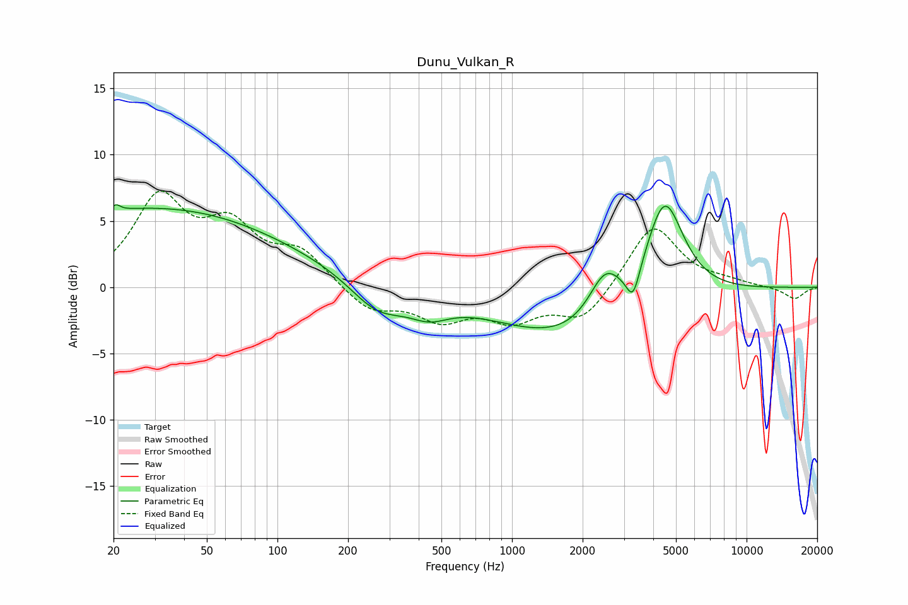

# Dunu_Vulkan_R
See [usage instructions](https://github.com/jaakkopasanen/AutoEq#usage) for more options and info.

### Parametric EQs
Apply preamp of -6.3 dB when using parametric equalizer.

|   # | Type    |   Fc (Hz) |    Q |   Gain (dB) |
|-----|---------|-----------|------|-------------|
|   1 | Peaking |        21 | 5.71 |         3.3 |
|   2 | Peaking |        21 | 5.38 |        -2.9 |
|   3 | Peaking |        23 | 0.24 |         5.6 |
|   4 | Peaking |       112 | 0.35 |         1.1 |
|   5 | Peaking |       267 | 1.19 |        -2.4 |
|   6 | Peaking |       443 | 1.6  |        -1.4 |
|   7 | Peaking |      1873 | 0.42 |        -4.1 |
|   8 | Peaking |      2487 | 2.01 |         3.5 |
|   9 | Peaking |      3282 | 4.95 |        -2.3 |
|  10 | Peaking |      4465 | 1.65 |         8.2 |

### Fixed Band EQs
When using fixed band (also called graphic) equalizer, apply preamp of **-7.4 dB** (if available) and set gains manually with these parameters.

|   # | Type    |   Fc (Hz) |    Q |   Gain (dB) |
|-----|---------|-----------|------|-------------|
|   1 | Peaking |        31 | 1.41 |         6.4 |
|   2 | Peaking |        62 | 1.41 |         4   |
|   3 | Peaking |       125 | 1.41 |         2.4 |
|   4 | Peaking |       250 | 1.41 |        -1.8 |
|   5 | Peaking |       500 | 1.41 |        -2.2 |
|   6 | Peaking |      1000 | 1.41 |        -2.2 |
|   7 | Peaking |      2000 | 1.41 |        -2.5 |
|   8 | Peaking |      4000 | 1.41 |         4.9 |
|   9 | Peaking |      8000 | 1.41 |         0.3 |
|  10 | Peaking |     16000 | 1.41 |        -0.9 |

### Graphs

