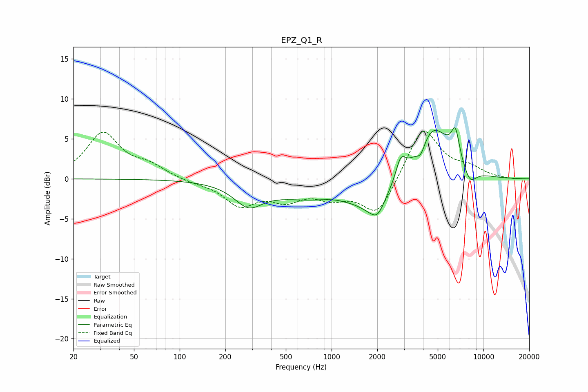

# EPZ_Q1_R
See [usage instructions](https://github.com/jaakkopasanen/AutoEq#usage) for more options and info.

### Parametric EQs
Apply preamp of -6.5 dB when using parametric equalizer.

|   # | Type    |   Fc (Hz) |    Q |   Gain (dB) |
|-----|---------|-----------|------|-------------|
|   1 | Peaking |       284 | 1.54 |        -2.6 |
|   2 | Peaking |      1029 | 1.17 |         1   |
|   3 | Peaking |      1763 | 2.16 |        -0.7 |
|   4 | Peaking |      1815 | 0.27 |        -4.3 |
|   5 | Peaking |      2008 | 2.91 |        -2.2 |
|   6 | Peaking |      2852 | 4.35 |         2.6 |
|   7 | Peaking |      3867 | 4.6  |        -1.7 |
|   8 | Peaking |      4574 | 0.98 |         9.3 |
|   9 | Peaking |      6533 | 5.17 |         3.5 |
|  10 | Peaking |      8130 | 3.04 |        -2   |

### Fixed Band EQs
When using fixed band (also called graphic) equalizer, apply preamp of **-6.0 dB** (if available) and set gains manually with these parameters.

|   # | Type    |   Fc (Hz) |    Q |   Gain (dB) |
|-----|---------|-----------|------|-------------|
|   1 | Peaking |        31 | 1.41 |         5.6 |
|   2 | Peaking |        62 | 1.41 |         1.4 |
|   3 | Peaking |       125 | 1.41 |        -0.4 |
|   4 | Peaking |       250 | 1.41 |        -3.1 |
|   5 | Peaking |       500 | 1.41 |        -2.2 |
|   6 | Peaking |      1000 | 1.41 |        -1.9 |
|   7 | Peaking |      2000 | 1.41 |        -4.6 |
|   8 | Peaking |      4000 | 1.41 |         6.6 |
|   9 | Peaking |      8000 | 1.41 |         1.1 |
|  10 | Peaking |     16000 | 1.41 |        -0.1 |

### Graphs

