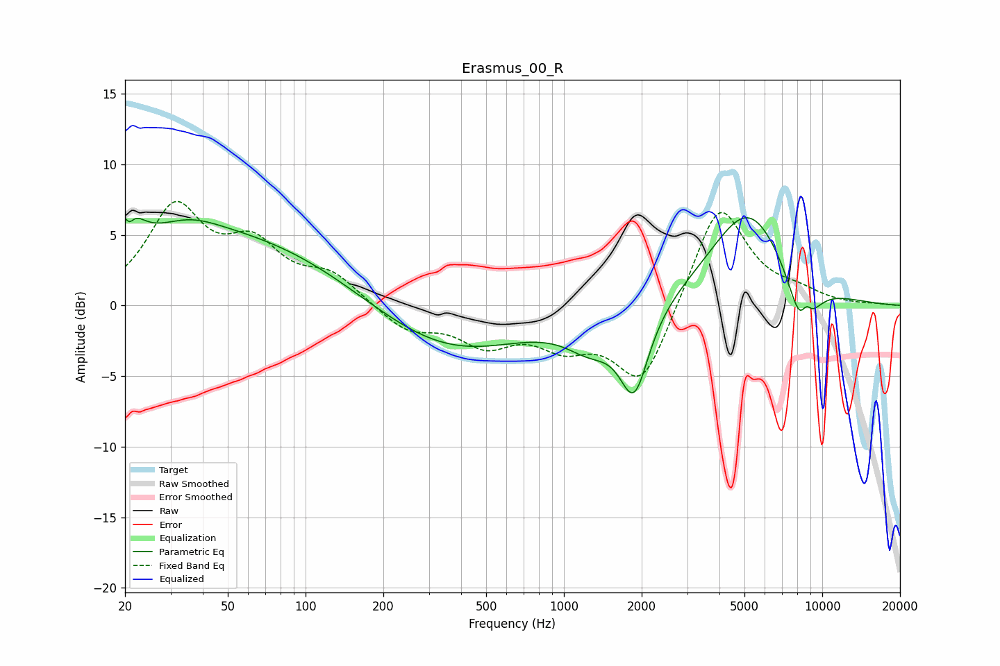

# Erasmus_00_R
See [usage instructions](https://github.com/jaakkopasanen/AutoEq#usage) for more options and info.

### Parametric EQs
Apply preamp of -6.3 dB when using parametric equalizer.

|   # | Type    |   Fc (Hz) |    Q |   Gain (dB) |
|-----|---------|-----------|------|-------------|
|   1 | Peaking |        20 | 3.5  |         4.8 |
|   2 | Peaking |        21 | 5.96 |        -2.9 |
|   3 | Peaking |        35 | 1.2  |         1.1 |
|   4 | Peaking |        48 | 0.3  |         5.1 |
|   5 | Peaking |       355 | 0.47 |        -3.5 |
|   6 | Peaking |      1264 | 1.45 |        -2.1 |
|   7 | Peaking |      1871 | 2.48 |        -5.9 |
|   8 | Peaking |      5170 | 0.91 |         7   |
|   9 | Peaking |      8412 | 2.43 |        -4.7 |
|  10 | Peaking |      8663 | 5.82 |         1.6 |

### Fixed Band EQs
When using fixed band (also called graphic) equalizer, apply preamp of **-7.5 dB** (if available) and set gains manually with these parameters.

|   # | Type    |   Fc (Hz) |    Q |   Gain (dB) |
|-----|---------|-----------|------|-------------|
|   1 | Peaking |        31 | 1.41 |         6.6 |
|   2 | Peaking |        62 | 1.41 |         3.7 |
|   3 | Peaking |       125 | 1.41 |         2   |
|   4 | Peaking |       250 | 1.41 |        -1.7 |
|   5 | Peaking |       500 | 1.41 |        -2.4 |
|   6 | Peaking |      1000 | 1.41 |        -2.3 |
|   7 | Peaking |      2000 | 1.41 |        -5.8 |
|   8 | Peaking |      4000 | 1.41 |         7.6 |
|   9 | Peaking |      8000 | 1.41 |         0.7 |
|  10 | Peaking |     16000 | 1.41 |         0.1 |

### Graphs

