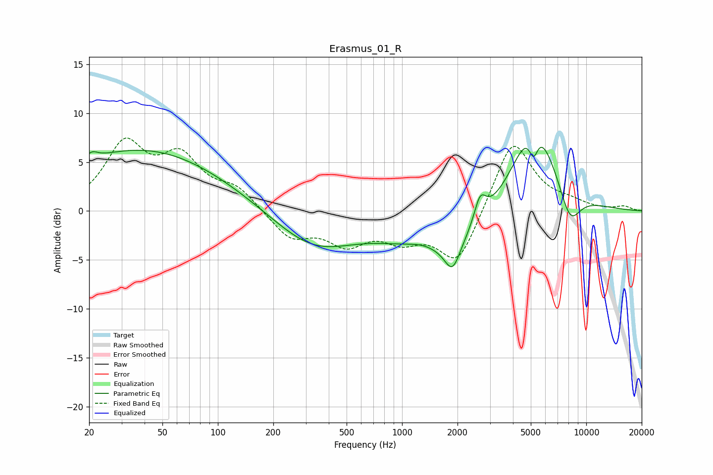

# Erasmus_01_R
See [usage instructions](https://github.com/jaakkopasanen/AutoEq#usage) for more options and info.

### Parametric EQs
Apply preamp of -6.6 dB when using parametric equalizer.

|   # | Type    |   Fc (Hz) |    Q |   Gain (dB) |
|-----|---------|-----------|------|-------------|
|   1 | Peaking |        21 | 4.46 |         0.8 |
|   2 | Peaking |        39 | 0.31 |         6.3 |
|   3 | Peaking |       330 | 0.64 |        -3.8 |
|   4 | Peaking |      1309 | 1.37 |         1.2 |
|   5 | Peaking |      1607 | 0.6  |        -4.8 |
|   6 | Peaking |      1879 | 3.37 |        -2.8 |
|   7 | Peaking |      2653 | 4.39 |         2.7 |
|   8 | Peaking |      5176 | 5.37 |        -2.9 |
|   9 | Peaking |      5202 | 1.15 |        10.1 |
|  10 | Peaking |      8150 | 2.25 |        -3.8 |

### Fixed Band EQs
When using fixed band (also called graphic) equalizer, apply preamp of **-7.6 dB** (if available) and set gains manually with these parameters.

|   # | Type    |   Fc (Hz) |    Q |   Gain (dB) |
|-----|---------|-----------|------|-------------|
|   1 | Peaking |        31 | 1.41 |         6.5 |
|   2 | Peaking |        62 | 1.41 |         4.9 |
|   3 | Peaking |       125 | 1.41 |         2.1 |
|   4 | Peaking |       250 | 1.41 |        -2.7 |
|   5 | Peaking |       500 | 1.41 |        -3   |
|   6 | Peaking |      1000 | 1.41 |        -2.4 |
|   7 | Peaking |      2000 | 1.41 |        -5.5 |
|   8 | Peaking |      4000 | 1.41 |         7.6 |
|   9 | Peaking |      8000 | 1.41 |         0.7 |
|  10 | Peaking |     16000 | 1.41 |         0.4 |

### Graphs

