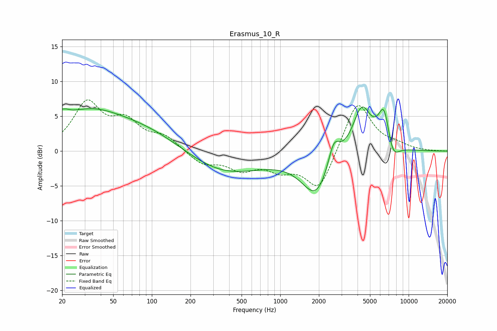

# Erasmus_10_R
See [usage instructions](https://github.com/jaakkopasanen/AutoEq#usage) for more options and info.

### Parametric EQs
Apply preamp of -6.4 dB when using parametric equalizer.

|   # | Type    |   Fc (Hz) |    Q |   Gain (dB) |
|-----|---------|-----------|------|-------------|
|   1 | Peaking |        20 | 5.17 |         3.6 |
|   2 | Peaking |        20 | 5.75 |        -2.8 |
|   3 | Peaking |        35 | 0.82 |         1.2 |
|   4 | Peaking |        44 | 0.18 |         5.2 |
|   5 | Peaking |       316 | 0.43 |        -4.3 |
|   6 | Peaking |      1912 | 1.24 |        -6.3 |
|   7 | Peaking |      2609 | 3.13 |         3.8 |
|   8 | Peaking |      4317 | 1.93 |         6.6 |
|   9 | Peaking |      6438 | 2.97 |         6   |
|  10 | Peaking |      7474 | 2.73 |        -3   |

### Fixed Band EQs
When using fixed band (also called graphic) equalizer, apply preamp of **-7.5 dB** (if available) and set gains manually with these parameters.

|   # | Type    |   Fc (Hz) |    Q |   Gain (dB) |
|-----|---------|-----------|------|-------------|
|   1 | Peaking |        31 | 1.41 |         6.6 |
|   2 | Peaking |        62 | 1.41 |         3.7 |
|   3 | Peaking |       125 | 1.41 |         1.9 |
|   4 | Peaking |       250 | 1.41 |        -1.9 |
|   5 | Peaking |       500 | 1.41 |        -2.3 |
|   6 | Peaking |      1000 | 1.41 |        -2.2 |
|   7 | Peaking |      2000 | 1.41 |        -5.7 |
|   8 | Peaking |      4000 | 1.41 |         7.5 |
|   9 | Peaking |      8000 | 1.41 |         0.7 |
|  10 | Peaking |     16000 | 1.41 |         0   |

### Graphs

