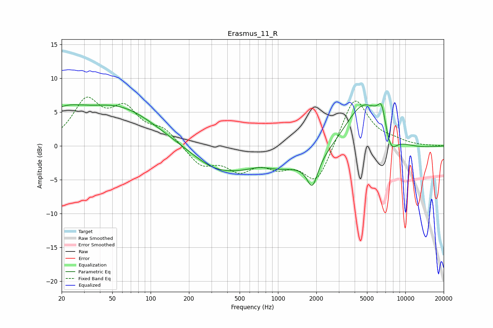

# Erasmus_11_R
See [usage instructions](https://github.com/jaakkopasanen/AutoEq#usage) for more options and info.

### Parametric EQs
Apply preamp of -6.3 dB when using parametric equalizer.

|   # | Type    |   Fc (Hz) |    Q |   Gain (dB) |
|-----|---------|-----------|------|-------------|
|   1 | Peaking |        20 | 0.82 |         3.7 |
|   2 | Peaking |        57 | 0.49 |         5.3 |
|   3 | Peaking |       316 | 0.74 |        -2.3 |
|   4 | Peaking |       718 | 1.69 |         0.6 |
|   5 | Peaking |      1863 | 3.33 |        -4.1 |
|   6 | Peaking |      2177 | 0.18 |        -4.5 |
|   7 | Peaking |      4686 | 0.76 |        10   |
|   8 | Peaking |      6203 | 5.34 |        -0.7 |
|   9 | Peaking |      6450 | 4.01 |         4.1 |
|  10 | Peaking |      7669 | 2.75 |        -3.1 |

### Fixed Band EQs
When using fixed band (also called graphic) equalizer, apply preamp of **-7.3 dB** (if available) and set gains manually with these parameters.

|   # | Type    |   Fc (Hz) |    Q |   Gain (dB) |
|-----|---------|-----------|------|-------------|
|   1 | Peaking |        31 | 1.41 |         6.2 |
|   2 | Peaking |        62 | 1.41 |         4.8 |
|   3 | Peaking |       125 | 1.41 |         2.2 |
|   4 | Peaking |       250 | 1.41 |        -2.8 |
|   5 | Peaking |       500 | 1.41 |        -3.1 |
|   6 | Peaking |      1000 | 1.41 |        -2.4 |
|   7 | Peaking |      2000 | 1.41 |        -5.6 |
|   8 | Peaking |      4000 | 1.41 |         7.6 |
|   9 | Peaking |      8000 | 1.41 |         0.6 |
|  10 | Peaking |     16000 | 1.41 |         0   |

### Graphs

