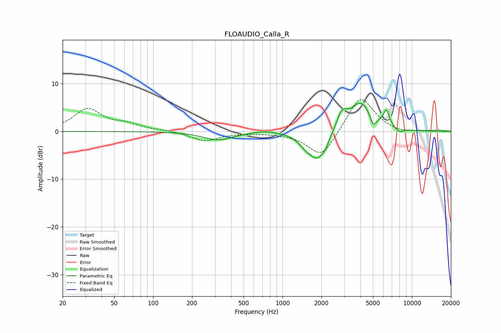

# FLOAUDIO_Calla_R
See [usage instructions](https://github.com/jaakkopasanen/AutoEq#usage) for more options and info.

### Parametric EQs
Apply preamp of -6.0 dB when using parametric equalizer.

|   # | Type    |   Fc (Hz) |    Q |   Gain (dB) |
|-----|---------|-----------|------|-------------|
|   1 | Peaking |       318 | 1.23 |        -1.8 |
|   2 | Peaking |       733 | 1.59 |         0.5 |
|   3 | Peaking |      1487 | 3.61 |        -0.9 |
|   4 | Peaking |      1851 | 1.87 |        -6.1 |
|   5 | Peaking |      2132 | 5.52 |        -0.7 |
|   6 | Peaking |      2870 | 3.41 |         3.5 |
|   7 | Peaking |      4030 | 1.63 |         6.1 |
|   8 | Peaking |      5013 | 6    |        -2.4 |
|   9 | Peaking |      6345 | 5.9  |         3.3 |
|  10 | Peaking |      8002 | 4.16 |        -0.9 |

### Fixed Band EQs
When using fixed band (also called graphic) equalizer, apply preamp of **-6.8 dB** (if available) and set gains manually with these parameters.

|   # | Type    |   Fc (Hz) |    Q |   Gain (dB) |
|-----|---------|-----------|------|-------------|
|   1 | Peaking |        31 | 1.41 |         4.6 |
|   2 | Peaking |        62 | 1.41 |         1.3 |
|   3 | Peaking |       125 | 1.41 |         0.2 |
|   4 | Peaking |       250 | 1.41 |        -2   |
|   5 | Peaking |       500 | 1.41 |        -0.2 |
|   6 | Peaking |      1000 | 1.41 |        -0.3 |
|   7 | Peaking |      2000 | 1.41 |        -5.7 |
|   8 | Peaking |      4000 | 1.41 |         7.8 |
|   9 | Peaking |      8000 | 1.41 |        -0.5 |
|  10 | Peaking |     16000 | 1.41 |         0.3 |

### Graphs

