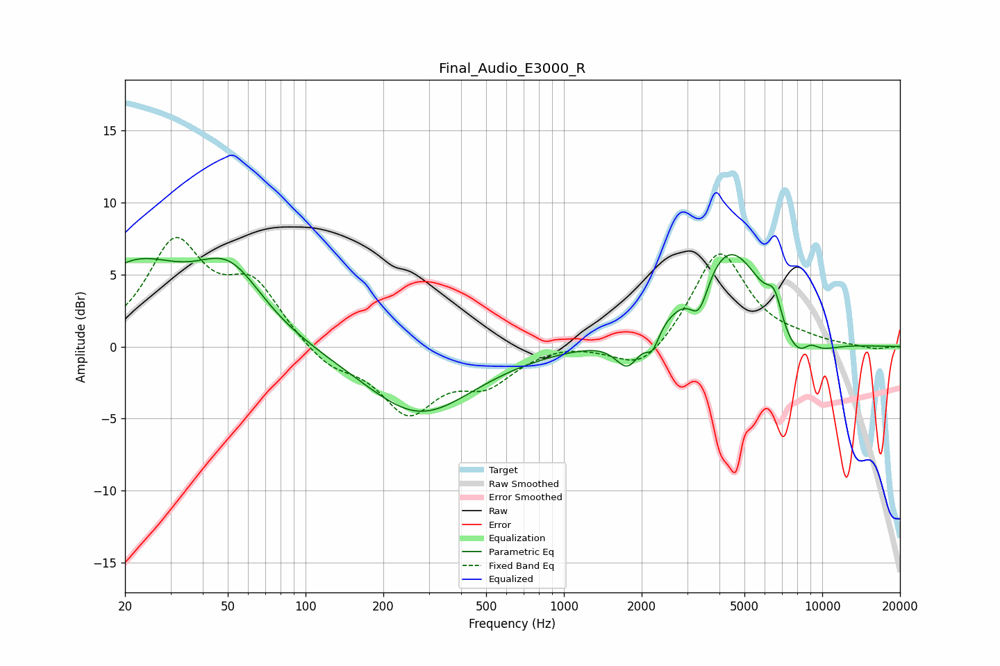

# Final_Audio_E3000_R
See [usage instructions](https://github.com/jaakkopasanen/AutoEq#usage) for more options and info.

### Parametric EQs
Apply preamp of -6.5 dB when using parametric equalizer.

|   # | Type    |   Fc (Hz) |    Q |   Gain (dB) |
|-----|---------|-----------|------|-------------|
|   1 | Peaking |        22 | 0.73 |         5.2 |
|   2 | Peaking |        51 | 1.08 |         4.5 |
|   3 | Peaking |       276 | 0.67 |        -4.7 |
|   4 | Peaking |      1767 | 2.93 |        -2.3 |
|   5 | Peaking |      2205 | 5.52 |        -1.4 |
|   6 | Peaking |      3342 | 3.88 |        -2.5 |
|   7 | Peaking |      4387 | 0.93 |         7.4 |
|   8 | Peaking |      6535 | 4.57 |         2   |
|   9 | Peaking |      7985 | 1.35 |        -3.3 |
|  10 | Peaking |      8998 | 3.75 |         0.9 |

### Fixed Band EQs
When using fixed band (also called graphic) equalizer, apply preamp of **-7.7 dB** (if available) and set gains manually with these parameters.

|   # | Type    |   Fc (Hz) |    Q |   Gain (dB) |
|-----|---------|-----------|------|-------------|
|   1 | Peaking |        31 | 1.41 |         6.9 |
|   2 | Peaking |        62 | 1.41 |         4   |
|   3 | Peaking |       125 | 1.41 |        -1.4 |
|   4 | Peaking |       250 | 1.41 |        -4.3 |
|   5 | Peaking |       500 | 1.41 |        -2.3 |
|   6 | Peaking |      1000 | 1.41 |         0.3 |
|   7 | Peaking |      2000 | 1.41 |        -2   |
|   8 | Peaking |      4000 | 1.41 |         6.7 |
|   9 | Peaking |      8000 | 1.41 |         0.3 |
|  10 | Peaking |     16000 | 1.41 |        -0.2 |

### Graphs

