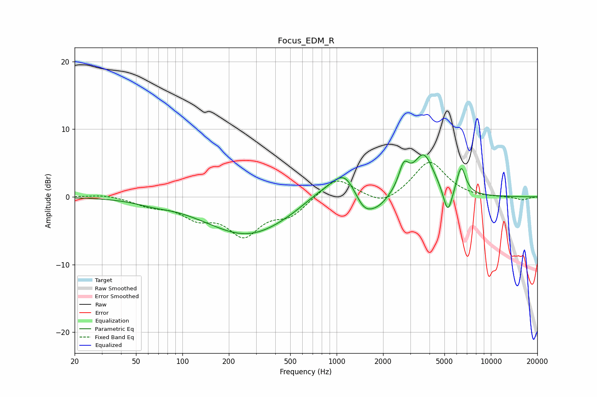

# Focus_EDM_R
See [usage instructions](https://github.com/jaakkopasanen/AutoEq#usage) for more options and info.

### Parametric EQs
Apply preamp of -6.3 dB when using parametric equalizer.

|   # | Type    |   Fc (Hz) |    Q |   Gain (dB) |
|-----|---------|-----------|------|-------------|
|   1 | Peaking |        64 | 1.37 |        -0.5 |
|   2 | Peaking |       266 | 0.51 |        -5.7 |
|   3 | Peaking |       775 | 1.1  |         1.6 |
|   4 | Peaking |      1131 | 1.7  |         4.2 |
|   5 | Peaking |      1506 | 2.08 |        -3.1 |
|   6 | Peaking |      1886 | 2.11 |        -1.3 |
|   7 | Peaking |      2724 | 4.4  |         3.4 |
|   8 | Peaking |      3668 | 2.06 |         6.1 |
|   9 | Peaking |      5254 | 4.67 |        -4.1 |
|  10 | Peaking |      6417 | 4.66 |         4.2 |

### Fixed Band EQs
When using fixed band (also called graphic) equalizer, apply preamp of **-5.2 dB** (if available) and set gains manually with these parameters.

|   # | Type    |   Fc (Hz) |    Q |   Gain (dB) |
|-----|---------|-----------|------|-------------|
|   1 | Peaking |        31 | 1.41 |         0.4 |
|   2 | Peaking |        62 | 1.41 |        -1.1 |
|   3 | Peaking |       125 | 1.41 |        -2.6 |
|   4 | Peaking |       250 | 1.41 |        -5.2 |
|   5 | Peaking |       500 | 1.41 |        -2.5 |
|   6 | Peaking |      1000 | 1.41 |         3.1 |
|   7 | Peaking |      2000 | 1.41 |        -1.5 |
|   8 | Peaking |      4000 | 1.41 |         5.3 |
|   9 | Peaking |      8000 | 1.41 |        -0.2 |
|  10 | Peaking |     16000 | 1.41 |        -0.5 |

### Graphs

