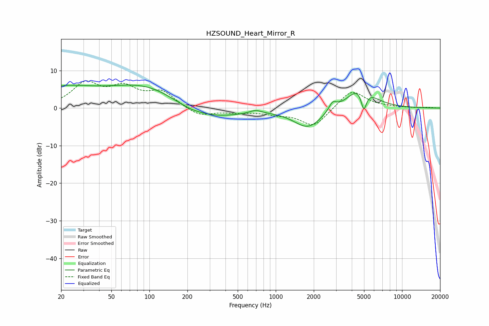

# HZSOUND_Heart_Mirror_R
See [usage instructions](https://github.com/jaakkopasanen/AutoEq#usage) for more options and info.

### Parametric EQs
Apply preamp of -6.2 dB when using parametric equalizer.

|   # | Type    |   Fc (Hz) |    Q |   Gain (dB) |
|-----|---------|-----------|------|-------------|
|   1 | Peaking |        20 | 0.58 |         4.7 |
|   2 | Peaking |       104 | 0.44 |         7   |
|   3 | Peaking |       187 | 0.7  |        -2.3 |
|   4 | Peaking |       215 | 3.81 |        -0.1 |
|   5 | Peaking |       308 | 0.58 |        -3.2 |
|   6 | Peaking |       695 | 3    |         0.9 |
|   7 | Peaking |      1804 | 1.25 |        -5.3 |
|   8 | Peaking |      2822 | 4.69 |         2.2 |
|   9 | Peaking |      4706 | 1.44 |         6.3 |
|  10 | Peaking |      4978 | 5.97 |        -5.8 |

### Fixed Band EQs
When using fixed band (also called graphic) equalizer, apply preamp of **-7.4 dB** (if available) and set gains manually with these parameters.

|   # | Type    |   Fc (Hz) |    Q |   Gain (dB) |
|-----|---------|-----------|------|-------------|
|   1 | Peaking |        31 | 1.41 |         6.2 |
|   2 | Peaking |        62 | 1.41 |         4.7 |
|   3 | Peaking |       125 | 1.41 |         4.1 |
|   4 | Peaking |       250 | 1.41 |        -2.3 |
|   5 | Peaking |       500 | 1.41 |        -0.9 |
|   6 | Peaking |      1000 | 1.41 |        -1.2 |
|   7 | Peaking |      2000 | 1.41 |        -5   |
|   8 | Peaking |      4000 | 1.41 |         5   |
|   9 | Peaking |      8000 | 1.41 |         0.2 |
|  10 | Peaking |     16000 | 1.41 |         0.1 |

### Graphs

