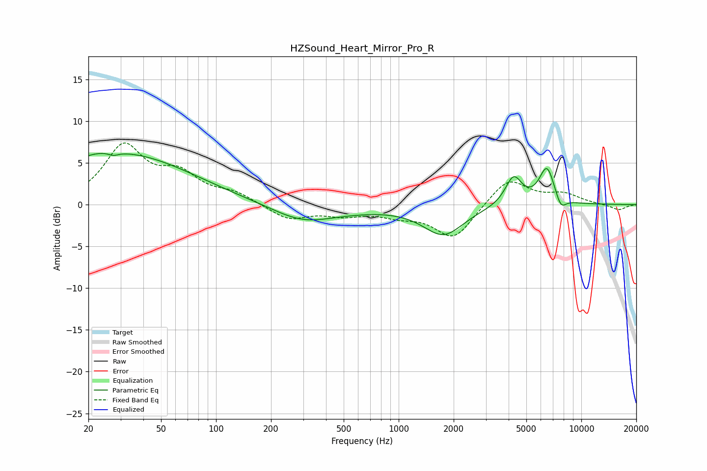

# HZSound_Heart_Mirror_Pro_R
See [usage instructions](https://github.com/jaakkopasanen/AutoEq#usage) for more options and info.

### Parametric EQs
Apply preamp of -6.2 dB when using parametric equalizer.

|   # | Type    |   Fc (Hz) |    Q |   Gain (dB) |
|-----|---------|-----------|------|-------------|
|   1 | Peaking |        20 | 0.92 |         1.4 |
|   2 | Peaking |        28 | 5.85 |        -3.5 |
|   3 | Peaking |        28 | 6    |         3.1 |
|   4 | Peaking |        34 | 0.4  |         5.5 |
|   5 | Peaking |       295 | 0.86 |        -1.8 |
|   6 | Peaking |       474 | 0.57 |        -0.5 |
|   7 | Peaking |      1758 | 1.27 |        -3.5 |
|   8 | Peaking |      4256 | 3.07 |         3.4 |
|   9 | Peaking |      6485 | 3.2  |         4.5 |
|  10 | Peaking |      7718 | 4.56 |        -1.6 |

### Fixed Band EQs
When using fixed band (also called graphic) equalizer, apply preamp of **-7.5 dB** (if available) and set gains manually with these parameters.

|   # | Type    |   Fc (Hz) |    Q |   Gain (dB) |
|-----|---------|-----------|------|-------------|
|   1 | Peaking |        31 | 1.41 |         6.8 |
|   2 | Peaking |        62 | 1.41 |         3.1 |
|   3 | Peaking |       125 | 1.41 |         1.2 |
|   4 | Peaking |       250 | 1.41 |        -1.8 |
|   5 | Peaking |       500 | 1.41 |        -1   |
|   6 | Peaking |      1000 | 1.41 |        -1   |
|   7 | Peaking |      2000 | 1.41 |        -4.1 |
|   8 | Peaking |      4000 | 1.41 |         3.3 |
|   9 | Peaking |      8000 | 1.41 |         1.2 |
|  10 | Peaking |     16000 | 1.41 |        -0.7 |

### Graphs

