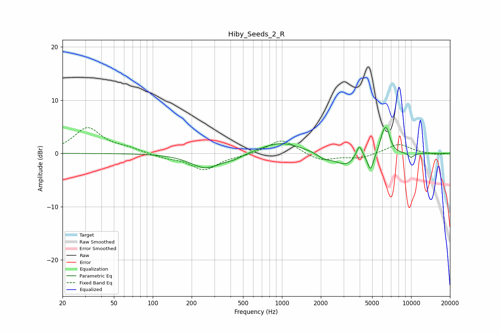

# Hiby_Seeds_2_R
See [usage instructions](https://github.com/jaakkopasanen/AutoEq#usage) for more options and info.

### Parametric EQs
Apply preamp of -5.0 dB when using parametric equalizer.

|   # | Type    |   Fc (Hz) |    Q |   Gain (dB) |
|-----|---------|-----------|------|-------------|
|   1 | Peaking |       256 | 1.23 |        -2.7 |
|   2 | Peaking |       423 | 1.9  |        -0.7 |
|   3 | Peaking |       986 | 0.9  |         2.1 |
|   4 | Peaking |      2119 | 2.77 |        -0.9 |
|   5 | Peaking |      3092 | 1.67 |        -2.3 |
|   6 | Peaking |      3967 | 6    |         2.5 |
|   7 | Peaking |      4852 | 6    |        -3.2 |
|   8 | Peaking |      6033 | 5.92 |         2.1 |
|   9 | Peaking |      6467 | 4.82 |         4   |
|  10 | Peaking |     10000 | 5.75 |        -0.8 |

### Fixed Band EQs
When using fixed band (also called graphic) equalizer, apply preamp of **-4.9 dB** (if available) and set gains manually with these parameters.

|   # | Type    |   Fc (Hz) |    Q |   Gain (dB) |
|-----|---------|-----------|------|-------------|
|   1 | Peaking |        31 | 1.41 |         4.7 |
|   2 | Peaking |        62 | 1.41 |         0.8 |
|   3 | Peaking |       125 | 1.41 |        -0.7 |
|   4 | Peaking |       250 | 1.41 |        -3   |
|   5 | Peaking |       500 | 1.41 |        -0.3 |
|   6 | Peaking |      1000 | 1.41 |         2.8 |
|   7 | Peaking |      2000 | 1.41 |        -1.4 |
|   8 | Peaking |      4000 | 1.41 |        -0.9 |
|   9 | Peaking |      8000 | 1.41 |         1.8 |
|  10 | Peaking |     16000 | 1.41 |        -0.3 |

### Graphs

