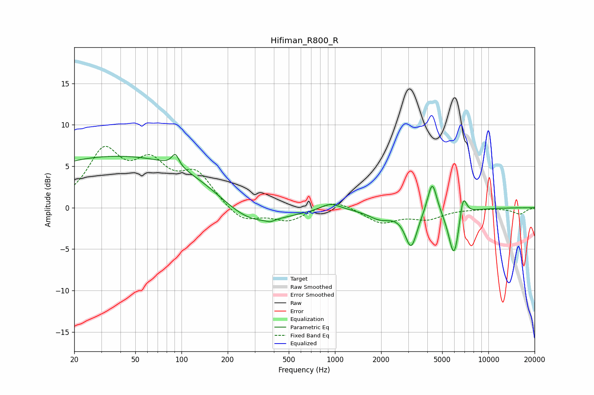

# Hifiman_R800_R
See [usage instructions](https://github.com/jaakkopasanen/AutoEq#usage) for more options and info.

### Parametric EQs
Apply preamp of -6.5 dB when using parametric equalizer.

|   # | Type    |   Fc (Hz) |    Q |   Gain (dB) |
|-----|---------|-----------|------|-------------|
|   1 | Peaking |        47 | 0.18 |         6.4 |
|   2 | Peaking |        91 | 6    |         1.5 |
|   3 | Peaking |       272 | 0.64 |        -4.2 |
|   4 | Peaking |       379 | 5.92 |        -0.3 |
|   5 | Peaking |       934 | 2.23 |         0.9 |
|   6 | Peaking |      1974 | 1.84 |        -1.2 |
|   7 | Peaking |      3138 | 3.58 |        -4.5 |
|   8 | Peaking |      4305 | 4.66 |         4   |
|   9 | Peaking |      5974 | 3.86 |        -6.1 |
|  10 | Peaking |      6833 | 5.79 |         3.2 |

### Fixed Band EQs
When using fixed band (also called graphic) equalizer, apply preamp of **-7.5 dB** (if available) and set gains manually with these parameters.

|   # | Type    |   Fc (Hz) |    Q |   Gain (dB) |
|-----|---------|-----------|------|-------------|
|   1 | Peaking |        31 | 1.41 |         6.4 |
|   2 | Peaking |        62 | 1.41 |         4.5 |
|   3 | Peaking |       125 | 1.41 |         3.8 |
|   4 | Peaking |       250 | 1.41 |        -1.8 |
|   5 | Peaking |       500 | 1.41 |        -1.5 |
|   6 | Peaking |      1000 | 1.41 |         1.1 |
|   7 | Peaking |      2000 | 1.41 |        -1.8 |
|   8 | Peaking |      4000 | 1.41 |        -1.2 |
|   9 | Peaking |      8000 | 1.41 |        -0.1 |
|  10 | Peaking |     16000 | 1.41 |        -0.8 |

### Graphs

