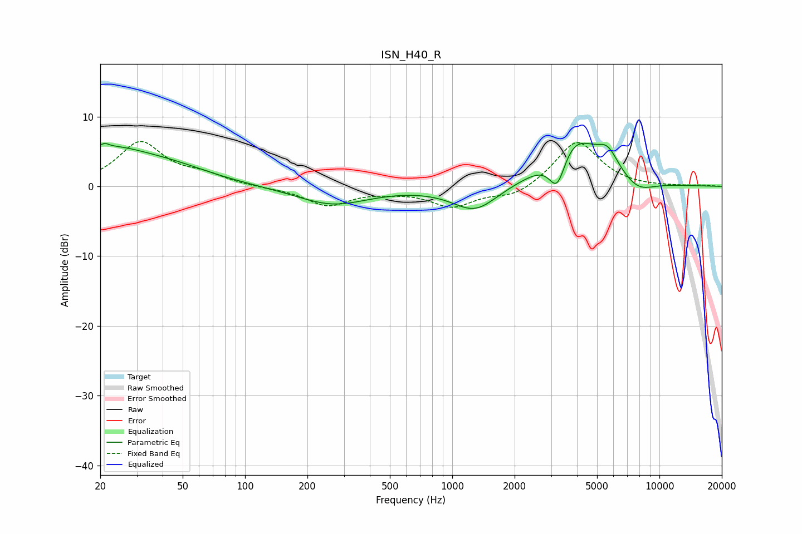

# ISN_H40_R
See [usage instructions](https://github.com/jaakkopasanen/AutoEq#usage) for more options and info.

### Parametric EQs
Apply preamp of -6.3 dB when using parametric equalizer.

|   # | Type    |   Fc (Hz) |    Q |   Gain (dB) |
|-----|---------|-----------|------|-------------|
|   1 | Peaking |        21 | 0.57 |         5.4 |
|   2 | Peaking |        21 | 5.98 |         3.1 |
|   3 | Peaking |        21 | 5.66 |        -2.7 |
|   4 | Peaking |        48 | 0.76 |         1.2 |
|   5 | Peaking |       264 | 0.81 |        -2.6 |
|   6 | Peaking |      1290 | 1.28 |        -3.7 |
|   7 | Peaking |      3215 | 3.37 |        -5.5 |
|   8 | Peaking |      3804 | 1.13 |         7.5 |
|   9 | Peaking |      5630 | 2.68 |         2.9 |
|  10 | Peaking |      7854 | 1.7  |        -1.8 |

### Fixed Band EQs
When using fixed band (also called graphic) equalizer, apply preamp of **-6.5 dB** (if available) and set gains manually with these parameters.

|   # | Type    |   Fc (Hz) |    Q |   Gain (dB) |
|-----|---------|-----------|------|-------------|
|   1 | Peaking |        31 | 1.41 |         6.2 |
|   2 | Peaking |        62 | 1.41 |         1.3 |
|   3 | Peaking |       125 | 1.41 |        -0.2 |
|   4 | Peaking |       250 | 1.41 |        -2.7 |
|   5 | Peaking |       500 | 1.41 |        -0.4 |
|   6 | Peaking |      1000 | 1.41 |        -2.8 |
|   7 | Peaking |      2000 | 1.41 |        -1.5 |
|   8 | Peaking |      4000 | 1.41 |         6.6 |
|   9 | Peaking |      8000 | 1.41 |        -0.1 |
|  10 | Peaking |     16000 | 1.41 |         0.1 |

### Graphs

