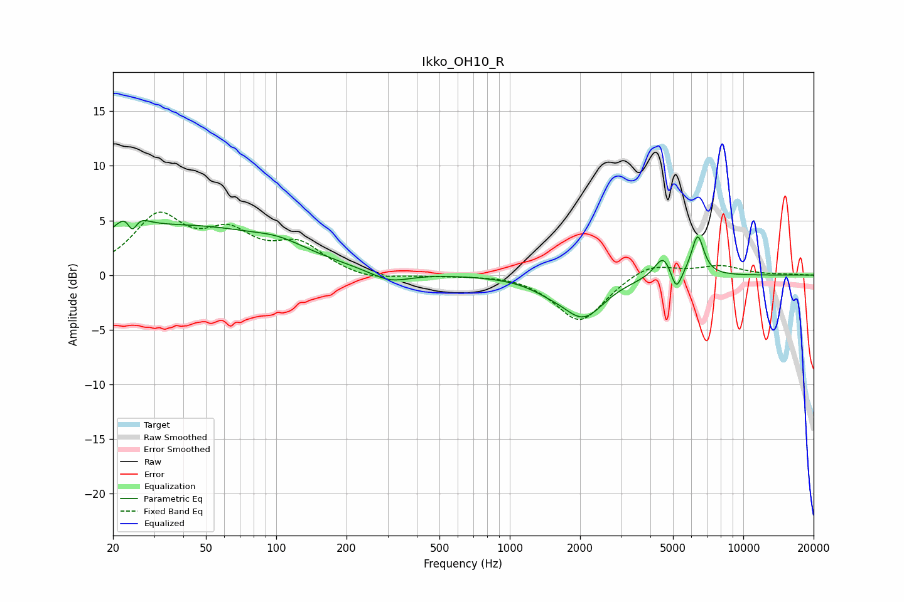

# Ikko_OH10_R
See [usage instructions](https://github.com/jaakkopasanen/AutoEq#usage) for more options and info.

### Parametric EQs
Apply preamp of -5.1 dB when using parametric equalizer.

|   # | Type    |   Fc (Hz) |    Q |   Gain (dB) |
|-----|---------|-----------|------|-------------|
|   1 | Peaking |        24 | 3.32 |         3.4 |
|   2 | Peaking |        24 | 5.93 |        -3   |
|   3 | Peaking |        40 | 0.34 |         4.4 |
|   4 | Peaking |       104 | 1.31 |         0.7 |
|   5 | Peaking |       306 | 1.64 |        -1   |
|   6 | Peaking |      1452 | 1.71 |        -0.6 |
|   7 | Peaking |      2069 | 1.56 |        -3.7 |
|   8 | Peaking |      4550 | 3.78 |         2.1 |
|   9 | Peaking |      5161 | 6    |        -2.1 |
|  10 | Peaking |      6377 | 5.2  |         3.7 |

### Fixed Band EQs
When using fixed band (also called graphic) equalizer, apply preamp of **-5.9 dB** (if available) and set gains manually with these parameters.

|   # | Type    |   Fc (Hz) |    Q |   Gain (dB) |
|-----|---------|-----------|------|-------------|
|   1 | Peaking |        31 | 1.41 |         5.1 |
|   2 | Peaking |        62 | 1.41 |         3.2 |
|   3 | Peaking |       125 | 1.41 |         2.5 |
|   4 | Peaking |       250 | 1.41 |        -0.6 |
|   5 | Peaking |       500 | 1.41 |        -0.1 |
|   6 | Peaking |      1000 | 1.41 |         0.2 |
|   7 | Peaking |      2000 | 1.41 |        -4.3 |
|   8 | Peaking |      4000 | 1.41 |         1.2 |
|   9 | Peaking |      8000 | 1.41 |         0.8 |
|  10 | Peaking |     16000 | 1.41 |         0.1 |

### Graphs

