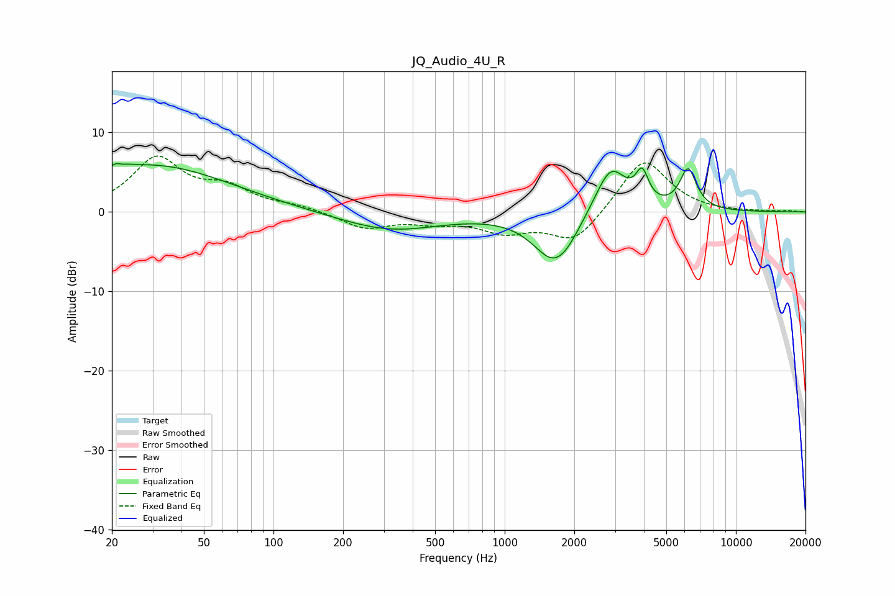

# JQ_Audio_4U_R
See [usage instructions](https://github.com/jaakkopasanen/AutoEq#usage) for more options and info.

### Parametric EQs
Apply preamp of -6.2 dB when using parametric equalizer.

|   # | Type    |   Fc (Hz) |    Q |   Gain (dB) |
|-----|---------|-----------|------|-------------|
|   1 | Peaking |        20 | 0.53 |         1.3 |
|   2 | Peaking |        22 | 5.33 |         3.6 |
|   3 | Peaking |        22 | 5.97 |        -3   |
|   4 | Peaking |        33 | 0.44 |         4.8 |
|   5 | Peaking |       319 | 0.65 |        -2.3 |
|   6 | Peaking |      1617 | 1.57 |        -5.6 |
|   7 | Peaking |      1858 | 2.24 |        -1.2 |
|   8 | Peaking |      2874 | 2.05 |         6.1 |
|   9 | Peaking |      3931 | 5.25 |         3.6 |
|  10 | Peaking |      6212 | 3.82 |         5.1 |

### Fixed Band EQs
When using fixed band (also called graphic) equalizer, apply preamp of **-7.1 dB** (if available) and set gains manually with these parameters.

|   # | Type    |   Fc (Hz) |    Q |   Gain (dB) |
|-----|---------|-----------|------|-------------|
|   1 | Peaking |        31 | 1.41 |         6.6 |
|   2 | Peaking |        62 | 1.41 |         2.6 |
|   3 | Peaking |       125 | 1.41 |         0.6 |
|   4 | Peaking |       250 | 1.41 |        -2   |
|   5 | Peaking |       500 | 1.41 |        -1   |
|   6 | Peaking |      1000 | 1.41 |        -2.2 |
|   7 | Peaking |      2000 | 1.41 |        -3.9 |
|   8 | Peaking |      4000 | 1.41 |         6.9 |
|   9 | Peaking |      8000 | 1.41 |        -0.1 |
|  10 | Peaking |     16000 | 1.41 |         0.2 |

### Graphs

