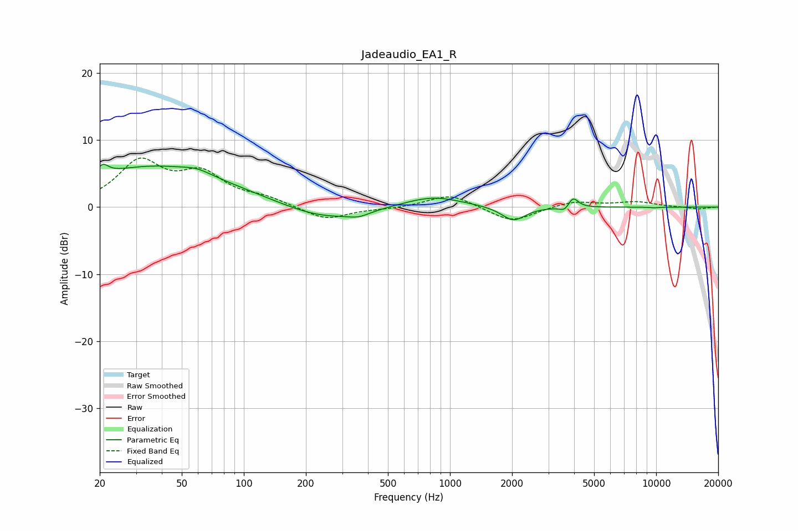

# Jadeaudio_EA1_R
See [usage instructions](https://github.com/jaakkopasanen/AutoEq#usage) for more options and info.

### Parametric EQs
Apply preamp of -6.5 dB when using parametric equalizer.

|   # | Type    |   Fc (Hz) |    Q |   Gain (dB) |
|-----|---------|-----------|------|-------------|
|   1 | Peaking |        21 | 5.26 |         1.5 |
|   2 | Peaking |        37 | 0.39 |         6.1 |
|   3 | Peaking |        59 | 2.29 |         0.6 |
|   4 | Peaking |       240 | 0.75 |        -2.1 |
|   5 | Peaking |       360 | 2.59 |        -0.7 |
|   6 | Peaking |       824 | 1.01 |         1.7 |
|   7 | Peaking |      2031 | 2.48 |        -2.2 |
|   8 | Peaking |      3614 | 5.97 |        -0.8 |
|   9 | Peaking |      3945 | 5.76 |         1.7 |
|  10 | Peaking |      9754 | 5.81 |        -0.1 |

### Fixed Band EQs
When using fixed band (also called graphic) equalizer, apply preamp of **-7.4 dB** (if available) and set gains manually with these parameters.

|   # | Type    |   Fc (Hz) |    Q |   Gain (dB) |
|-----|---------|-----------|------|-------------|
|   1 | Peaking |        31 | 1.41 |         6.4 |
|   2 | Peaking |        62 | 1.41 |         4.4 |
|   3 | Peaking |       125 | 1.41 |         1.1 |
|   4 | Peaking |       250 | 1.41 |        -2   |
|   5 | Peaking |       500 | 1.41 |        -0.2 |
|   6 | Peaking |      1000 | 1.41 |         2   |
|   7 | Peaking |      2000 | 1.41 |        -2.3 |
|   8 | Peaking |      4000 | 1.41 |         0.9 |
|   9 | Peaking |      8000 | 1.41 |         0.8 |
|  10 | Peaking |     16000 | 1.41 |        -0.3 |

### Graphs

