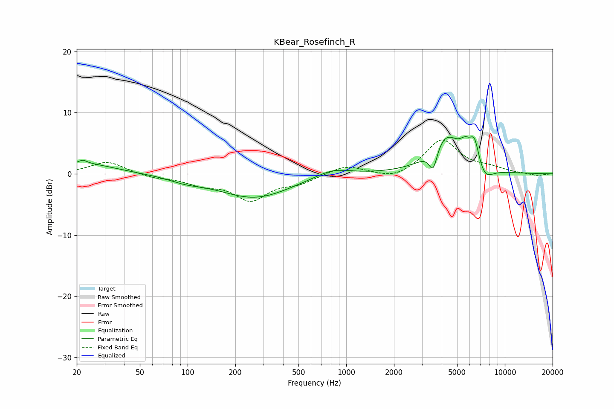

# KBear_Rosefinch_R
See [usage instructions](https://github.com/jaakkopasanen/AutoEq#usage) for more options and info.

### Parametric EQs
Apply preamp of -6.2 dB when using parametric equalizer.

|   # | Type    |   Fc (Hz) |    Q |   Gain (dB) |
|-----|---------|-----------|------|-------------|
|   1 | Peaking |        22 | 0.74 |         1.7 |
|   2 | Peaking |        22 | 5.83 |         0.6 |
|   3 | Peaking |        97 | 1.36 |        -0.7 |
|   4 | Peaking |       265 | 0.62 |        -3.9 |
|   5 | Peaking |       820 | 1.26 |         1.3 |
|   6 | Peaking |      3532 | 5.36 |        -3.7 |
|   7 | Peaking |      4241 | 1.47 |         6.1 |
|   8 | Peaking |      5643 | 3.94 |         2.1 |
|   9 | Peaking |      6443 | 4.58 |         4.1 |
|  10 | Peaking |      7439 | 2.64 |        -2.3 |

### Fixed Band EQs
When using fixed band (also called graphic) equalizer, apply preamp of **-5.6 dB** (if available) and set gains manually with these parameters.

|   # | Type    |   Fc (Hz) |    Q |   Gain (dB) |
|-----|---------|-----------|------|-------------|
|   1 | Peaking |        31 | 1.41 |         2   |
|   2 | Peaking |        62 | 1.41 |        -0.6 |
|   3 | Peaking |       125 | 1.41 |        -1.5 |
|   4 | Peaking |       250 | 1.41 |        -4   |
|   5 | Peaking |       500 | 1.41 |        -1.3 |
|   6 | Peaking |      1000 | 1.41 |         1.4 |
|   7 | Peaking |      2000 | 1.41 |        -1.1 |
|   8 | Peaking |      4000 | 1.41 |         5.6 |
|   9 | Peaking |      8000 | 1.41 |         0.8 |
|  10 | Peaking |     16000 | 1.41 |        -0.3 |

### Graphs

