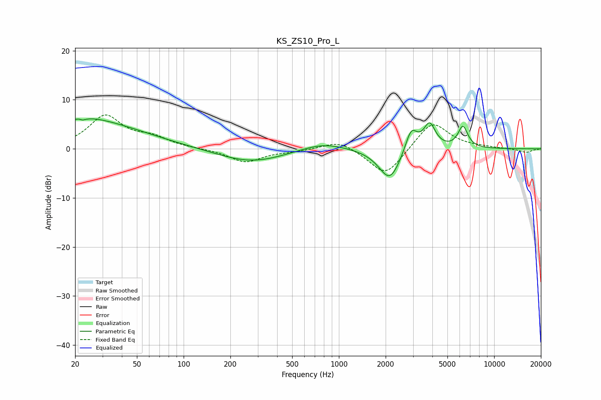

# KS_ZS10_Pro_L
See [usage instructions](https://github.com/jaakkopasanen/AutoEq#usage) for more options and info.

### Parametric EQs
Apply preamp of -6.2 dB when using parametric equalizer.

|   # | Type    |   Fc (Hz) |    Q |   Gain (dB) |
|-----|---------|-----------|------|-------------|
|   1 | Peaking |        22 | 5.35 |         3.5 |
|   2 | Peaking |        22 | 5.6  |        -3.6 |
|   3 | Peaking |        23 | 0.98 |         1.3 |
|   4 | Peaking |        27 | 0.41 |         4.9 |
|   5 | Peaking |       273 | 0.66 |        -2.8 |
|   6 | Peaking |       786 | 0.99 |         1.6 |
|   7 | Peaking |      2127 | 2.01 |        -6.6 |
|   8 | Peaking |      2923 | 3.61 |         4.9 |
|   9 | Peaking |      3836 | 3.67 |         5   |
|  10 | Peaking |      6292 | 4.4  |         4.4 |

### Fixed Band EQs
When using fixed band (also called graphic) equalizer, apply preamp of **-7.0 dB** (if available) and set gains manually with these parameters.

|   # | Type    |   Fc (Hz) |    Q |   Gain (dB) |
|-----|---------|-----------|------|-------------|
|   1 | Peaking |        31 | 1.41 |         6.6 |
|   2 | Peaking |        62 | 1.41 |         1.9 |
|   3 | Peaking |       125 | 1.41 |        -0   |
|   4 | Peaking |       250 | 1.41 |        -2.7 |
|   5 | Peaking |       500 | 1.41 |        -0.4 |
|   6 | Peaking |      1000 | 1.41 |         1.9 |
|   7 | Peaking |      2000 | 1.41 |        -5.8 |
|   8 | Peaking |      4000 | 1.41 |         5.8 |
|   9 | Peaking |      8000 | 1.41 |         0.2 |
|  10 | Peaking |     16000 | 1.41 |        -0.8 |

### Graphs

