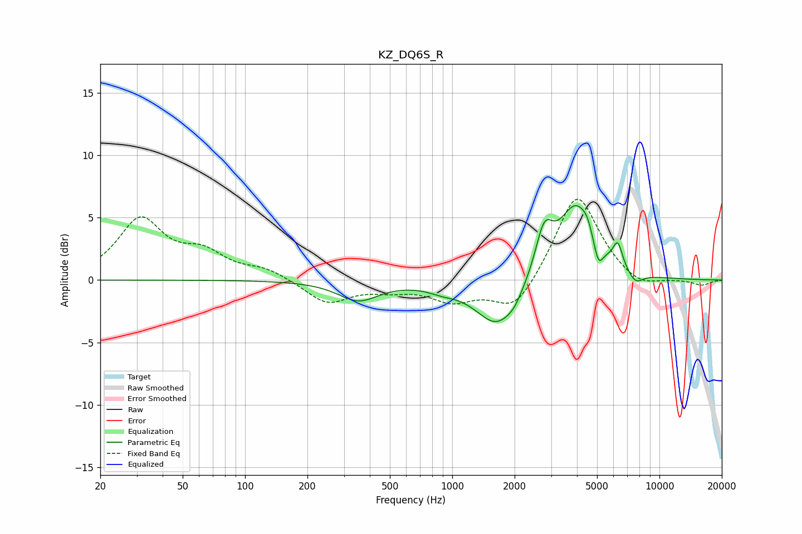

# KZ_DQ6S_R
See [usage instructions](https://github.com/jaakkopasanen/AutoEq#usage) for more options and info.

### Parametric EQs
Apply preamp of -6.1 dB when using parametric equalizer.

|   # | Type    |   Fc (Hz) |    Q |   Gain (dB) |
|-----|---------|-----------|------|-------------|
|   1 | Peaking |       352 | 1.46 |        -1.6 |
|   2 | Peaking |       892 | 2.1  |        -0.4 |
|   3 | Peaking |      1663 | 1.33 |        -3.9 |
|   4 | Peaking |      1999 | 4.14 |        -0.4 |
|   5 | Peaking |      2775 | 3.36 |         3.5 |
|   6 | Peaking |      3959 | 1.6  |         6   |
|   7 | Peaking |      4484 | 6    |         0.6 |
|   8 | Peaking |      5075 | 6    |        -1.9 |
|   9 | Peaking |      6295 | 6    |         1.9 |
|  10 | Peaking |      7657 | 3.58 |        -0.9 |

### Fixed Band EQs
When using fixed band (also called graphic) equalizer, apply preamp of **-6.6 dB** (if available) and set gains manually with these parameters.

|   # | Type    |   Fc (Hz) |    Q |   Gain (dB) |
|-----|---------|-----------|------|-------------|
|   1 | Peaking |        31 | 1.41 |         4.7 |
|   2 | Peaking |        62 | 1.41 |         1.8 |
|   3 | Peaking |       125 | 1.41 |         0.8 |
|   4 | Peaking |       250 | 1.41 |        -1.9 |
|   5 | Peaking |       500 | 1.41 |        -0.6 |
|   6 | Peaking |      1000 | 1.41 |        -1.5 |
|   7 | Peaking |      2000 | 1.41 |        -2.6 |
|   8 | Peaking |      4000 | 1.41 |         7.1 |
|   9 | Peaking |      8000 | 1.41 |        -0.9 |
|  10 | Peaking |     16000 | 1.41 |        -0.4 |

### Graphs

