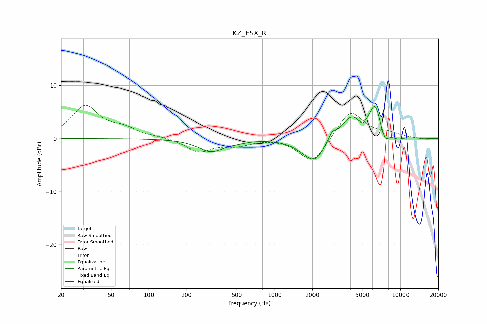

# KZ_ESX_R
See [usage instructions](https://github.com/jaakkopasanen/AutoEq#usage) for more options and info.

### Parametric EQs
Apply preamp of -6.1 dB when using parametric equalizer.

|   # | Type    |   Fc (Hz) |    Q |   Gain (dB) |
|-----|---------|-----------|------|-------------|
|   1 | Peaking |       312 | 1.37 |        -2.4 |
|   2 | Peaking |       507 | 2.16 |        -0.3 |
|   3 | Peaking |      1655 | 1.5  |        -1   |
|   4 | Peaking |      2086 | 1.9  |        -3.8 |
|   5 | Peaking |      2874 | 5.1  |         1.3 |
|   6 | Peaking |      4063 | 1.72 |         4   |
|   7 | Peaking |      4969 | 6    |        -0.9 |
|   8 | Peaking |      6308 | 2.9  |         5.9 |
|   9 | Peaking |      7485 | 4.17 |        -2.5 |
|  10 | Peaking |      9489 | 3.03 |        -0.5 |

### Fixed Band EQs
When using fixed band (also called graphic) equalizer, apply preamp of **-6.4 dB** (if available) and set gains manually with these parameters.

|   # | Type    |   Fc (Hz) |    Q |   Gain (dB) |
|-----|---------|-----------|------|-------------|
|   1 | Peaking |        31 | 1.41 |         6   |
|   2 | Peaking |        62 | 1.41 |         1.6 |
|   3 | Peaking |       125 | 1.41 |         0.2 |
|   4 | Peaking |       250 | 1.41 |        -2.4 |
|   5 | Peaking |       500 | 1.41 |        -1.1 |
|   6 | Peaking |      1000 | 1.41 |         0.1 |
|   7 | Peaking |      2000 | 1.41 |        -4.8 |
|   8 | Peaking |      4000 | 1.41 |         5.4 |
|   9 | Peaking |      8000 | 1.41 |         0.8 |
|  10 | Peaking |     16000 | 1.41 |        -0.2 |

### Graphs

