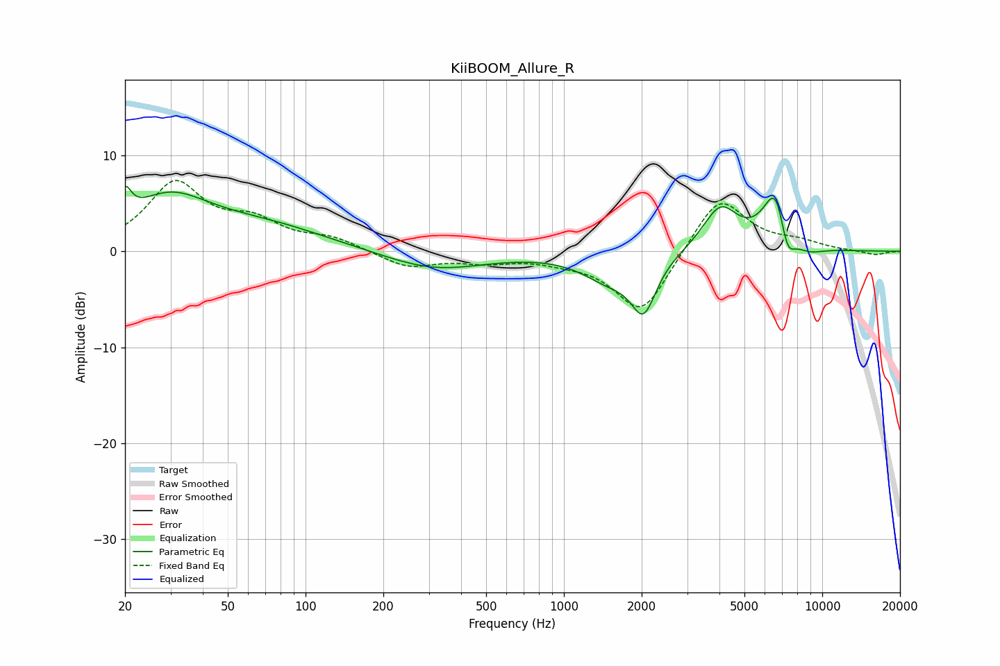

# KiiBOOM_Allure_R
See [usage instructions](https://github.com/jaakkopasanen/AutoEq#usage) for more options and info.

### Parametric EQs
Apply preamp of -6.8 dB when using parametric equalizer.

|   # | Type    |   Fc (Hz) |    Q |   Gain (dB) |
|-----|---------|-----------|------|-------------|
|   1 | Peaking |        20 | 5.96 |         2.9 |
|   2 | Peaking |        29 | 0.89 |         5   |
|   3 | Peaking |        70 | 0.57 |         2.3 |
|   4 | Peaking |       315 | 0.73 |        -2   |
|   5 | Peaking |      1497 | 1.34 |        -2.6 |
|   6 | Peaking |      2036 | 2.9  |        -5.4 |
|   7 | Peaking |      4032 | 2.03 |         4.6 |
|   8 | Peaking |      6663 | 2.67 |         7.2 |
|   9 | Peaking |      7288 | 4.23 |        -4.2 |
|  10 | Peaking |      8682 | 2.04 |        -1   |

### Fixed Band EQs
When using fixed band (also called graphic) equalizer, apply preamp of **-7.5 dB** (if available) and set gains manually with these parameters.

|   # | Type    |   Fc (Hz) |    Q |   Gain (dB) |
|-----|---------|-----------|------|-------------|
|   1 | Peaking |        31 | 1.41 |         6.9 |
|   2 | Peaking |        62 | 1.41 |         2.6 |
|   3 | Peaking |       125 | 1.41 |         1.2 |
|   4 | Peaking |       250 | 1.41 |        -1.7 |
|   5 | Peaking |       500 | 1.41 |        -0.9 |
|   6 | Peaking |      1000 | 1.41 |        -0.6 |
|   7 | Peaking |      2000 | 1.41 |        -6.7 |
|   8 | Peaking |      4000 | 1.41 |         6   |
|   9 | Peaking |      8000 | 1.41 |         0.8 |
|  10 | Peaking |     16000 | 1.41 |        -0.4 |

### Graphs

