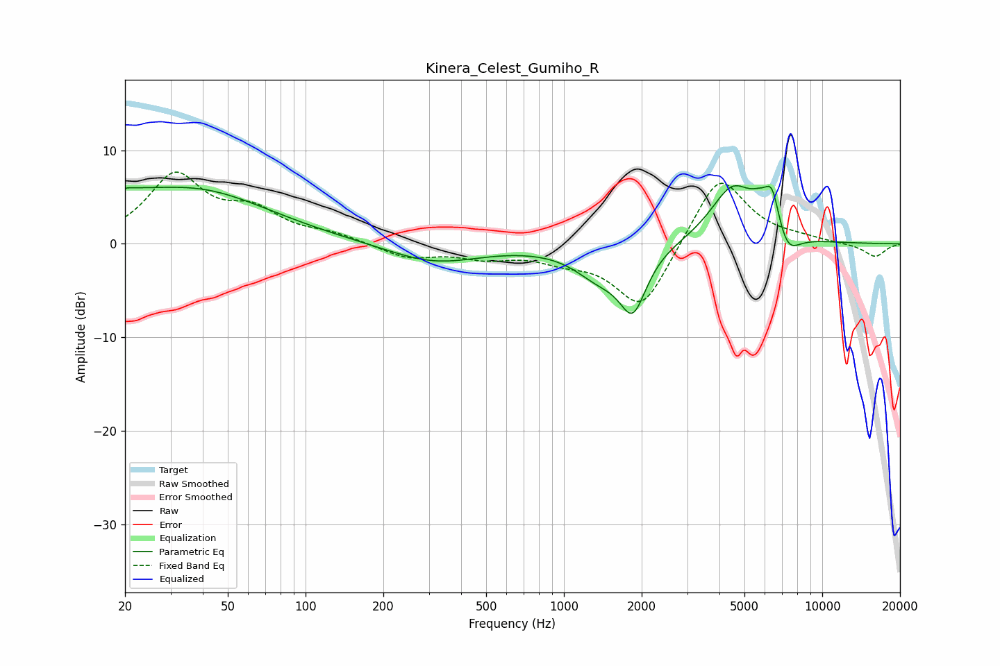

# Kinera_Celest_Gumiho_R
See [usage instructions](https://github.com/jaakkopasanen/AutoEq#usage) for more options and info.

### Parametric EQs
Apply preamp of -6.3 dB when using parametric equalizer.

|   # | Type    |   Fc (Hz) |    Q |   Gain (dB) |
|-----|---------|-----------|------|-------------|
|   1 | Peaking |        20 | 5.68 |         0.4 |
|   2 | Peaking |        20 | 1.31 |         1.7 |
|   3 | Peaking |        37 | 0.49 |         5.6 |
|   4 | Peaking |       315 | 0.79 |        -2.1 |
|   5 | Peaking |      1369 | 1.44 |        -3   |
|   6 | Peaking |      1850 | 2.67 |        -6.2 |
|   7 | Peaking |      4508 | 1.6  |         6.1 |
|   8 | Peaking |      5728 | 3.47 |         1.6 |
|   9 | Peaking |      6402 | 4.66 |         4.1 |
|  10 | Peaking |      7306 | 2.88 |        -2.6 |

### Fixed Band EQs
When using fixed band (also called graphic) equalizer, apply preamp of **-7.8 dB** (if available) and set gains manually with these parameters.

|   # | Type    |   Fc (Hz) |    Q |   Gain (dB) |
|-----|---------|-----------|------|-------------|
|   1 | Peaking |        31 | 1.41 |         7.1 |
|   2 | Peaking |        62 | 1.41 |         3   |
|   3 | Peaking |       125 | 1.41 |         0.9 |
|   4 | Peaking |       250 | 1.41 |        -1.5 |
|   5 | Peaking |       500 | 1.41 |        -1.2 |
|   6 | Peaking |      1000 | 1.41 |        -1.3 |
|   7 | Peaking |      2000 | 1.41 |        -7.2 |
|   8 | Peaking |      4000 | 1.41 |         7.8 |
|   9 | Peaking |      8000 | 1.41 |         0.4 |
|  10 | Peaking |     16000 | 1.41 |        -1.4 |

### Graphs

