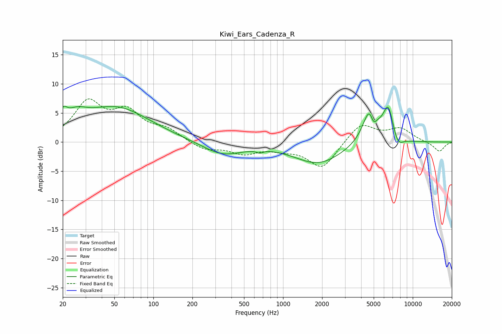

# Kiwi_Ears_Cadenza_R
See [usage instructions](https://github.com/jaakkopasanen/AutoEq#usage) for more options and info.

### Parametric EQs
Apply preamp of -6.3 dB when using parametric equalizer.

|   # | Type    |   Fc (Hz) |    Q |   Gain (dB) |
|-----|---------|-----------|------|-------------|
|   1 | Peaking |        20 | 4.6  |         2.3 |
|   2 | Peaking |        25 | 1.78 |         2.2 |
|   3 | Peaking |        51 | 0.54 |         5.9 |
|   4 | Peaking |       340 | 0.93 |        -2.2 |
|   5 | Peaking |       660 | 5.98 |        -0.4 |
|   6 | Peaking |      1869 | 0.76 |        -3.7 |
|   7 | Peaking |      4741 | 2.62 |         7.4 |
|   8 | Peaking |      4964 | 5.23 |        -3.3 |
|   9 | Peaking |      6472 | 3.44 |         5.6 |
|  10 | Peaking |      7676 | 3.35 |        -1.9 |

### Fixed Band EQs
When using fixed band (also called graphic) equalizer, apply preamp of **-7.5 dB** (if available) and set gains manually with these parameters.

|   # | Type    |   Fc (Hz) |    Q |   Gain (dB) |
|-----|---------|-----------|------|-------------|
|   1 | Peaking |        31 | 1.41 |         6.5 |
|   2 | Peaking |        62 | 1.41 |         4.6 |
|   3 | Peaking |       125 | 1.41 |         1.9 |
|   4 | Peaking |       250 | 1.41 |        -1.4 |
|   5 | Peaking |       500 | 1.41 |        -1.8 |
|   6 | Peaking |      1000 | 1.41 |        -0.9 |
|   7 | Peaking |      2000 | 1.41 |        -4.5 |
|   8 | Peaking |      4000 | 1.41 |         3.3 |
|   9 | Peaking |      8000 | 1.41 |         2.2 |
|  10 | Peaking |     16000 | 1.41 |        -1.7 |

### Graphs

