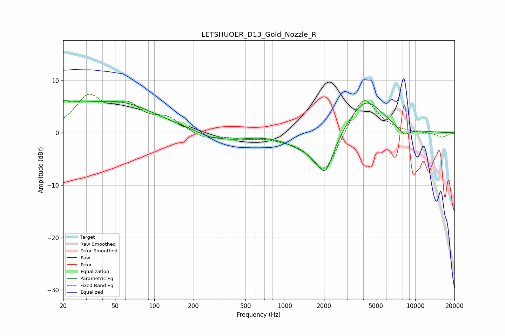

# LETSHUOER_D13_Gold_Nozzle_R
See [usage instructions](https://github.com/jaakkopasanen/AutoEq#usage) for more options and info.

### Parametric EQs
Apply preamp of -6.3 dB when using parametric equalizer.

|   # | Type    |   Fc (Hz) |    Q |   Gain (dB) |
|-----|---------|-----------|------|-------------|
|   1 | Peaking |        20 | 5.18 |         2.1 |
|   2 | Peaking |        24 | 1.84 |         1.6 |
|   3 | Peaking |        29 | 1.19 |         1.2 |
|   4 | Peaking |        55 | 0.52 |         5.4 |
|   5 | Peaking |       261 | 1.57 |        -0.9 |
|   6 | Peaking |       394 | 1.1  |        -1.1 |
|   7 | Peaking |      1438 | 1    |        -2.4 |
|   8 | Peaking |      2039 | 2.11 |        -7.3 |
|   9 | Peaking |      4165 | 1.07 |         6.6 |
|  10 | Peaking |      8221 | 2.85 |        -1.6 |

### Fixed Band EQs
When using fixed band (also called graphic) equalizer, apply preamp of **-7.5 dB** (if available) and set gains manually with these parameters.

|   # | Type    |   Fc (Hz) |    Q |   Gain (dB) |
|-----|---------|-----------|------|-------------|
|   1 | Peaking |        31 | 1.41 |         6.5 |
|   2 | Peaking |        62 | 1.41 |         4.4 |
|   3 | Peaking |       125 | 1.41 |         2.4 |
|   4 | Peaking |       250 | 1.41 |        -1.3 |
|   5 | Peaking |       500 | 1.41 |        -0.8 |
|   6 | Peaking |      1000 | 1.41 |        -0.6 |
|   7 | Peaking |      2000 | 1.41 |        -8   |
|   8 | Peaking |      4000 | 1.41 |         7.6 |
|   9 | Peaking |      8000 | 1.41 |        -0   |
|  10 | Peaking |     16000 | 1.41 |        -0.9 |

### Graphs

