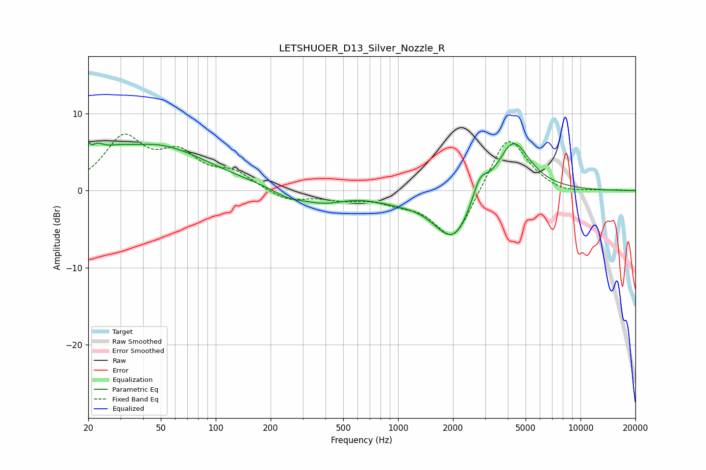

# LETSHUOER_D13_Silver_Nozzle_R
See [usage instructions](https://github.com/jaakkopasanen/AutoEq#usage) for more options and info.

### Parametric EQs
Apply preamp of -6.5 dB when using parametric equalizer.

|   # | Type    |   Fc (Hz) |    Q |   Gain (dB) |
|-----|---------|-----------|------|-------------|
|   1 | Peaking |        20 | 2.91 |         5.7 |
|   2 | Peaking |        21 | 5.64 |        -2.9 |
|   3 | Peaking |        29 | 2.64 |         0.5 |
|   4 | Peaking |        46 | 0.49 |         5.8 |
|   5 | Peaking |       251 | 1.64 |        -1   |
|   6 | Peaking |       387 | 1.22 |        -1.4 |
|   7 | Peaking |       967 | 1.08 |        -0.8 |
|   8 | Peaking |      2008 | 1.3  |        -6.7 |
|   9 | Peaking |      2806 | 3.46 |         2.9 |
|  10 | Peaking |      4274 | 1.54 |         7   |

### Fixed Band EQs
When using fixed band (also called graphic) equalizer, apply preamp of **-7.4 dB** (if available) and set gains manually with these parameters.

|   # | Type    |   Fc (Hz) |    Q |   Gain (dB) |
|-----|---------|-----------|------|-------------|
|   1 | Peaking |        31 | 1.41 |         6.5 |
|   2 | Peaking |        62 | 1.41 |         4.1 |
|   3 | Peaking |       125 | 1.41 |         2.1 |
|   4 | Peaking |       250 | 1.41 |        -1.4 |
|   5 | Peaking |       500 | 1.41 |        -0.9 |
|   6 | Peaking |      1000 | 1.41 |        -1.1 |
|   7 | Peaking |      2000 | 1.41 |        -6.8 |
|   8 | Peaking |      4000 | 1.41 |         7.7 |
|   9 | Peaking |      8000 | 1.41 |        -0.6 |
|  10 | Peaking |     16000 | 1.41 |         0.1 |

### Graphs

