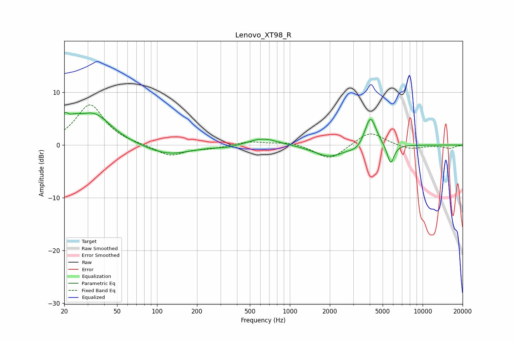

# Lenovo_XT98_R
See [usage instructions](https://github.com/jaakkopasanen/AutoEq#usage) for more options and info.

### Parametric EQs
Apply preamp of -6.3 dB when using parametric equalizer.

|   # | Type    |   Fc (Hz) |    Q |   Gain (dB) |
|-----|---------|-----------|------|-------------|
|   1 | Peaking |        20 | 5.74 |         2.6 |
|   2 | Peaking |        24 | 2.67 |         1.8 |
|   3 | Peaking |        33 | 1.08 |         5.8 |
|   4 | Peaking |       121 | 0.83 |        -1.9 |
|   5 | Peaking |       343 | 1.72 |        -0.4 |
|   6 | Peaking |       628 | 1.27 |         1.4 |
|   7 | Peaking |      1986 | 1.24 |        -2.3 |
|   8 | Peaking |      3222 | 2.73 |        -1   |
|   9 | Peaking |      4046 | 3.25 |         5.9 |
|  10 | Peaking |      5743 | 5.22 |        -3.8 |

### Fixed Band EQs
When using fixed band (also called graphic) equalizer, apply preamp of **-7.7 dB** (if available) and set gains manually with these parameters.

|   # | Type    |   Fc (Hz) |    Q |   Gain (dB) |
|-----|---------|-----------|------|-------------|
|   1 | Peaking |        31 | 1.41 |         7.7 |
|   2 | Peaking |        62 | 1.41 |         0   |
|   3 | Peaking |       125 | 1.41 |        -2.1 |
|   4 | Peaking |       250 | 1.41 |        -0.6 |
|   5 | Peaking |       500 | 1.41 |         0.7 |
|   6 | Peaking |      1000 | 1.41 |         0.6 |
|   7 | Peaking |      2000 | 1.41 |        -2.9 |
|   8 | Peaking |      4000 | 1.41 |         2.7 |
|   9 | Peaking |      8000 | 1.41 |        -0.9 |
|  10 | Peaking |     16000 | 1.41 |        -0.6 |

### Graphs

